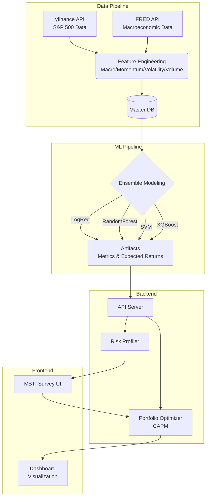
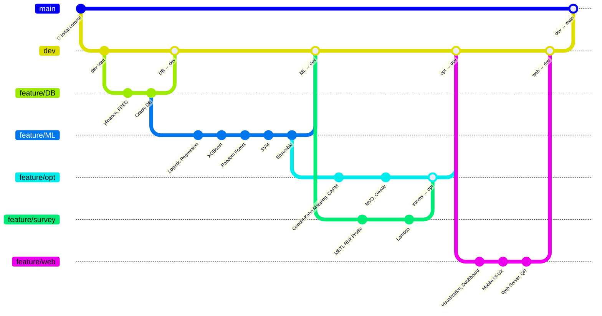

<p align="right">
  <a href="./README.md">🇰🇷 한국어</a>
</p>

# 📈 Red & Blue: AI-Powered Portfolio Recommendation via Investment MBTI & Optimal Asset Allocation

<div align="center">
  
  
  
  <br><br>
  
  
  
  
  
</div>

---

## 📋 Table of Contents
1. [Project Overview & Motivation](#1-project-overview--motivation)
2. [Team Members & Roles](#2-team-members--roles)
3. [Tech Stack & Algorithms](#3-tech-stack--algorithms)
4. [System Architecture & Pipeline](#4-system-architecture--pipeline)
5. [🔥 Key Challenges & Troubleshooting](#5--key-challenges--troubleshooting)
6. [Limitations & Future Work](#6-limitations--future-work)
7. [Project Significance](#7-project-significance)
8. [Screenshots](#8-screenshots)
9. [Directory Structure](#9-directory-structure)
10. [Branch Strategy & Collaboration](#10-branch-strategy--collaboration)
11. [Installation & Getting Started](#11-installation--getting-started)

---

## 1. 📝 Project Overview & Motivation

**"Which stocks should I buy?", "Will this go up or down?"**

These are the most common psychological barriers faced by beginners entering the U.S. stock market. This project was designed to lower the barrier of investing through intuitive, data-driven quantitative strategies.

**Red & Blue** is a full-stack web service that combines an individual's psychological risk tolerance (Investment MBTI) with ensemble machine learning (ML) prediction models and the Capital Asset Pricing Model (CAPM). It analyzes 16 features — including macroeconomic indicators and market volatility — across the top 300 S&P 500 stocks to forecast future returns, and then applies an Optimal Asset Allocation (OAA) algorithm to deliver a personalized AI-powered portfolio tailored to each user's risk profile.

---

## 2. 👥 Team Members & Roles

| Name | Role | Responsibilities | Github |
| :---: | :---: | :---: | :---: |
| **Youn Jaejeong** | **Lead & Financial Engineering** | - Overall project management & financial model mapping<br>- Portfolio optimization engine (MVO) & heuristic algorithm implementation | [@YounJJ](https://github.com/YounJJ) |
| **Lee Daehan** | **ML & Data Visualization** | - Ensemble ML-based stock analysis<br>- In-memory caching & performance optimization<br>- Data visualization implementation | [@eogks1235-byte](https://github.com/eogks1235-byte) |
| **Lee Yunwon** | **DB & Architecture** | - Oracle database architecture design<br>- CI/CD automation & mobile environment setup | [@YWL-0225](https://github.com/YWL-0225) |
| **Lee Woojeong** | **Frontend** | - Frontend development & dynamic UI/UX implementation<br>- Survey analysis & risk profiling algorithm design | [@wjlee111](https://github.com/wjlee111) |
| **Nam Kihyeok** | **Backend** | - Backend development & API server architecture<br>- Market data collection & processing | [@kiekuu](https://github.com/kiekuu) |

---

## 3. 🛠 Tech Stack & Algorithms

### 🧠 Machine Learning & Data Science
To overcome the limitations of any single model, we employed cross-validation and ensemble techniques.
- **Classification Models:** Trained 4 models — Logistic Regression, Random Forest, SVM, and XGBoost.
- **Ensemble Learning:** Linearly combined predictions from all 4 models to maximize robustness and accuracy.
- **Feature Engineering:** Generated 16 features across 4 domains — Macro (5), Momentum (5), Volatility (4), Volume (2) — using the yfinance and FRED APIs.

### 📈 Financial Engineering & Optimization
Mathematical algorithms that translate ML prediction probabilities into actionable investment weights.
- **Grinold-Kahn Modified Equation:** Converts ML classification probabilities into Z-Score-based signal strengths, then multiplies by volatility (TE) and historical model accuracy (IC) to produce rigorous expected alpha estimates.
- **Regime Shift Overlay:** A self-correction mechanism that captures dynamic market regime shifts through non-linear convergent momentum adjustment.
- **CAPM & Mean-Variance Optimization:** Performs Markowitz mean-variance optimization based on each user's risk aversion coefficient ($\lambda$) to maximize returns while simultaneously minimizing covariance-based risk.
- **Risk Profiling:** Derives the optimal risk aversion coefficient $\lambda = 1.155/Loss_{Rep}$ by inverse-mapping from a 95% one-tailed confidence interval (1.65) parametric VaR and the market's long-term Sharpe ratio (0.7) through a 12-question multidimensional survey.
- **Monte Carlo Simulation & Value at Risk (VaR):** Combines Geometric Brownian Motion (GBM) with a Brownian Bridge diffusion model to run Monte Carlo simulations estimating the probability distribution of 3-month portfolio performance. This produces a 5% VaR (Value at Risk) measure for extreme downside risk, visualized directly on the personalized dashboard.

### 📊 Data Engineering & Web Stack
- **Market Regime Detection & EWMA:** Mathematically identifies current market regimes and smoothly tracks price trends via Exponentially Weighted Moving Average.
- **Backend:** Asynchronous Python FastAPI server for logic serving.
- **Frontend:** Dynamic data visualization dashboard built with React.js, Vite, and Recharts.
- **MLOps:** Daily automated data collection and model evaluation (CI/CD) via GitHub Actions cron scheduling.

---

## 4. ⚙️ System Architecture & Pipeline



---

## 5. 🔥 Key Challenges & Troubleshooting

The core challenge of this project was not simply "picking good stocks."  
Real financial data is **extremely noisy**, and raw model predictions cannot be directly fed into portfolio optimization.  
Therefore, we designed a **4-stage hurdle structure** — Signal Validation → Expected Return Conversion → Forecast Error Correction → Constrained Optimization — to systematically bridge the gap between prediction and real-world portfolio management.

---

### Hurdle 1. Acknowledging the Limits of Regression; Redefining as a Classification Problem

Initially, we attempted a **regression** approach to directly predict each stock's 3-month future return.  
However, due to the extreme volatility, non-linearity, and noise inherent in stock price data, the regression model's explanatory power was effectively **R² ≈ 0**.  
In other words, "predicting the exact return figure" proved impractical given the available data structure and model complexity.

We therefore redefined the problem as a **binary classification** task: **"Will this stock outperform the S&P 500 by a certain margin over the next 3 months?"**  
This reframing was also justified from a financial engineering perspective — in real investment decisions, **relative advantage, directionality, and cross-sectional ranking** matter more than absolute return decimals.

To reduce single-model bias and ensure robustness against market regime changes, we ensembled **Logistic Regression, Random Forest, XGBoost, and SVM** to produce a final prediction probability.  
Additionally, to prevent **data leakage** — a critical risk in time-series data — we introduced a **Burn-in → Train → Embargo → Validation → Golden Gap → Test** split structure, blocking future information from leaking into the training process and enabling more conservative, realistic model evaluation.

Finally, we established a **Triple Hard Gate** system to pre-filter overfit or unreliable model outputs:

- **Train-Test Gap ≤ 25%p**: Curbs overfitting and ensures generalization
- **Accuracy ≥ 52%**: Establishes minimum statistical edge above random chance (50%)
- **IC ≥ 0.05**: Validates alpha signal quality beyond simple win-loss accuracy

The essence of Hurdle 1 was not "forcing predictions on every stock," but rather  
**building a filtering system that only passes signals reliable enough for actual investment to the next stage.**

---

### Hurdle 2. Translating Classification Probabilities into Expected Returns for Portfolio Input

A classification model's output is ultimately a **probability value**.  
But portfolio optimization requires not probabilities, but a **vector of expected returns** per stock.  
"An upside probability of 0.68" alone cannot drive the optimization engine — a **translation into the language of investable returns** was essential.

To achieve this, we adopted a **Modified Grinold-Kahn Equation**, converting prediction probabilities into signal strengths and combining them with **IC (prediction reliability)** and **3-month Tracking Error (TE_3M)** to produce per-stock expected alpha:

$$
E[\alpha_{3M}] = Signal \times IC \times TE_{3M}
$$

The advantage of this structure is clear:  
Even if the model emits a strong buy signal, expected alpha is **automatically discounted** if the stock's **prediction reliability (IC)** is low.  
That is, this formula functions not as a simple mapping, but as a **return conversion device that simultaneously reflects model confidence and risk**.

However, not all stocks passed the Hard Gate.  
In practice, only a subset demonstrated sufficient predictive power, and forcibly applying ML predictions to the rest would have compromised overall portfolio reliability.  
To solve this, we designed a **dual-track structure**: **stocks that passed the Hard Gate use ML-based expected returns**, while **those that didn't are supplemented with CAPM-based expected returns**.

$$
E[R_i] = R_f + \beta_i \bigl(E[R_M] - R_f\bigr)
$$

This design assigns **alpha-based active expected returns** to stocks where the model is strong, while providing **conservative, beta-based expected returns** to stocks with low model confidence — seamlessly covering the entire universe without gaps.  
In essence, Hurdle 2 implemented not "a system that only uses predictable stocks," but rather **a return generation system that satisfies both predictive capability and market consistency**.

---

### Hurdle 3. Introducing Adjusted Returns to Correct the Prediction-Realization Gap

Even if a model passes the Hard Gate, predicted and realized returns don't always align.  
Especially when market regimes shift abruptly or recent volatility isn't fully captured in the test window, significant **gaps** can emerge between predicted expected returns and actual performance.

This issue transcends simple model performance — it's a critical risk factor at the stage of recommending "good stocks" to actual users.  
Relying solely on raw predictions could mean that a statistically sound model still produces large realization gaps for specific stocks.

To address this, the project introduced the **Adjusted Return** concept:

1. **Calculate the Gap** between predicted and realized returns
2. **Standardize** by dividing the Gap by volatility → **Z-surprise**
3. **Normalize** the weight to $[-1, 1]$ using a **tanh function** to prevent extreme value blowout
4. **Compute the final Adjusted Return** by applying this correction term to the predicted expected return

This process was crucial because it captured **recent market regime dynamics and error structures** that raw predictions alone couldn't detect, enabling a more refined reassessment of recommended stock reliability.  
As a result, the recommendation pool was compressed not to "stocks with the highest predicted returns," but to **stocks with high predictions AND managed realization gaps**.

In essence, Hurdle 3 was the stage where we went beyond trusting the prediction model at face value,  
**modeling the prediction error itself to produce recommendation signals viable for real-world deployment**.

---

### Hurdle 4. Real-World Investment Constraints and the Optimization Complexity Explosion

Through Hurdles 1–3, the entire universe was refined into **a candidate pool reflecting reliability and realizability**.  
The remaining challenge was converting this pool into an actual portfolio.  
To achieve this, we designed **MVO (Mean-Variance Optimization)** with differentiated constraints per user persona (MBTI-based investment profile).

The optimization objective function:

$$
\max U = w^\top \mu - \frac{\lambda}{2} w^\top \Sigma w
$$

Where:

- $w$: Investment weight vector per stock  
- $\mu$: Per-stock expected return vector from Hurdles 2 & 3  
- $\Sigma$: EWMA-based covariance matrix  
- $\lambda$: Risk aversion coefficient derived from survey-based investment profile  

This formula itself can be solved as classical Quadratic Programming (QP).  
But the problem emerged the moment **real-world investment constraints** were added.

Per user persona:

- Minimum number of holdings
- Maximum weight per individual stock

varied, and on top of that, applying a **Universal Rule of "any included stock must have at least 5% allocation"** dramatically increased complexity.

This constraint mathematically requires a **binary inclusion variable**:

$$
0.05 z_i \le w_i \le w_i^{max} z_i,\quad z_i \in \{0,1\}
$$

The moment a stock is included, it must carry at least 5%; if excluded, its weight must be exactly 0 — a **binary decision** that transforms the problem from simple QP into **Mixed-Integer Quadratic Programming (MIQP)**.

MIQP requires Branch-and-Bound search, and computation explodes exponentially as the number of candidate stocks and constraints grows.  
While theoretically the most precise formulation, in practice **finding a stable solution within time limits using only open-source solvers was infeasible**.

---

### The Solution: Iterative Drop Heuristic

Instead of brute-forcing the MIQP head-on, we designed a **heuristic algorithm** that decomposes the problem into multiple rounds of **continuous optimization (QP)**.  
The core idea is simple:  
Rather than imposing the harsh "minimum 5%" integer constraint from the start, we iteratively remove low-competitiveness tail stocks first, then apply the strict constraint only at the final step.

#### Step 1. Initial Solve
First, we remove the minimum allocation (5%) constraint and perform an initial optimization across all refined candidate stocks.  
The purpose is to quickly identify which stocks are structurally uncompetitive within the portfolio.

#### Step 2. Greedy Drop
Stocks with very small weights — effectively tail positions — in the initial solution are deemed unlikely to become core positions even under strict constraints.  
These are selected as **Greedy Drop targets**, their weights fixed to 0, and removed from the candidate pool.

#### Step 3. Iterative Refinement
Re-optimization is performed on the new, reduced universe excluding dropped stocks.  
Through iteration, remaining stocks naturally receive larger weight allocations.  
The loop continues **until all included stocks satisfy the minimum 5% threshold**.

#### Step 4. Final Solve
Once the candidate pool is sufficiently compressed, a final optimization is run with all constraints — minimum allocation and maximum weight — strictly enforced.  
Since low-competitiveness stocks have already been pruned, finding a solution is far more stable and faster than directly solving the original MIQP.

---

### Why It Worked: Engineering Significance

The key insight isn't merely that "we used a workaround."  
Rather, by **decomposing the financial optimization problem into Signal Validation → Return Conversion → Error Correction → Combinatorial Optimization**, we reduced dimensionality at each stage, ultimately transforming a complex combinatorial optimization problem into a **computationally tractable form**.

In summary, this project solved the following engineering challenges:

- **Prediction problem**: Pivoted from failed regression to classification + ensemble  
- **Reliability problem**: Triple Hard Gate to block overfitting and noise  
- **Return problem**: Grinold-Kahn + CAPM for expected return generation  
- **Realization problem**: Adjusted Return to correct prediction-reality gaps  
- **Optimization problem**: Iterative Drop Heuristic to tame MIQP complexity  

Ultimately, this architecture implements not a single model, but an  
**end-to-end decision-making system that accounts for the imperfections of financial data and real-world investment constraints**.  
As a result, we achieved stable generation of portfolios that are computationally feasible, interpretable, and personalized to each user's risk profile.

---

## 6. 🚧 Limitations & Future Work

This project is meaningful in that it connects **user-profile-based risk aversion (λ)**, **ML-driven stock selection**, **Adjusted Return**, and **MVO-based optimization** into a single service flow.  
However, to evolve into a robust system applicable to real financial markets, several structural limitations must be acknowledged and addressed incrementally.

### 1) Current Limitations

#### 1-1. Reliability Bottleneck: Structural Limits on Hard Gate Pass Rate
The current pipeline aggressively filters out overfit models and low-value signals through a Triple Hard Gate (**Train-Test Gap ≤ 25%p, Accuracy ≥ 52%, IC ≥ 0.05**).  
While this conservatively manages model quality, it also significantly reduces the number of stocks that survive to the next stage.

In the current experiment, **only 79 out of 300 stocks passed the Hard Gate**, meaning the rest had to be supplemented with **CAPM-based conservative expected returns** instead of ML-derived ones.  
The system effectively "strongly utilizes only trustworthy stocks," but remains limited in terms of **model coverage**.

---

#### 1-2. Return Mapping Simplification: Theoretical & Practical Limits of CAPM Fallback
For stocks that failed the Hard Gate, **CAPM-based expected returns** were used to fill the gap.  
While practical for seamless universe coverage, CAPM — being essentially a **single-factor model (beta only)** — cannot sufficiently capture value/growth differentials, size effects, profitability, investment style, momentum factors, or idiosyncratic event risk.

---

#### 1-3. Prediction-Realization Gap: Mitigated but Not Fully Resolved by Adjusted Returns
The Z-surprise and tanh-based **Adjusted Return** effectively dampened gaps caused by insufficient recent volatility representation.  
However, this approach is fundamentally a **post-adjustment** mechanism — it does not eliminate the root prediction error itself.

---

#### 1-4. Optimization Limits: Local Optimum Risk of Heuristic-Based Solutions
The **Iterative Drop Heuristic** was highly effective from an engineering standpoint, but mathematically it cannot guarantee global optimality, may produce path-dependent elimination sequences, and could prematurely drop stocks with long-term diversification benefits.

---

#### 1-5. Feature Limitations: Structured Time-Series Focus
The current model relies primarily on **macroeconomic and price-based structured time-series features** (DXY, VIX, S&P 500 returns, momentum, volatility, volume).  
While advantageous for implementation stability and interpretability, it does not yet capture **alpha from unstructured information** such as earnings announcements, guidance changes, news events, or management commentary.

---

#### 1-6. Market Scope Limitation
The current universe is effectively limited to **U.S. large-cap stocks (top ~300 in S&P 500)**.  
While appropriate for ensuring data quality and stability in an initial version, long-term expansion to mid/small-caps, international markets, ETFs, bonds, commodities, and REITs would be necessary for a true multi-asset allocation platform.

---

### 2) Future Work

#### 2-1. Hard Gate Relaxation & Model Coverage Expansion
The most immediate improvement direction is transitioning from "precisely handling only passing stocks" to "more finely handling the entire universe" — potentially through continuous confidence scoring and ML/CAPM blended expected returns.

---

#### 2-2. Upgrading from CAPM to Multi-Factor Asset Pricing Models
For more precise expected return estimation of Hard Gate failures, future iterations could adopt **Fama-French 3/5-Factor** or **Carhart 4-Factor** models, introducing market (MKT), size (SMB), value (HML), profitability (RMW), investment (CMA), and momentum (MOM) factors.

---

#### 2-3. Unstructured Data Integration: NLP-Based Alpha Signals
To complement the current structured-data-heavy feature space, future work could incorporate **news sentiment scores, earnings call transcript tone analysis, SEC filing parsing, and keyword-based event factor generation** through NLP pipelines.

---

#### 2-4. Optimization Engine Enhancement
Future improvements could include benchmarking against commercial MIQP solvers, incorporating **meta-heuristics** (Genetic Algorithm, Simulated Annealing, Tabu Search), warm-start strategies, and additional real-world constraints such as rebalancing costs, turnover penalties, and sector caps.

---

#### 2-5. Dynamic Risk Measures & Adaptive Recommendation Logic
Future iterations could combine user behavioral data with market regime information to dynamically adjust risk profiles and recommendation logic — for example, automatically reinforcing conservative tendencies during volatility spikes, or recalibrating λ based on actual user selection/churn patterns.

---

#### 2-6. Market & Asset Class Expansion
Long-term vision extends beyond U.S. large-caps to include mid/small-caps, Korean and other developed/emerging market equities, ETFs, bonds, gold, commodities, and REITs — transforming the project from "a U.S. stock recommendation service" into **a universal, risk-profile-driven asset allocation platform**.

---

### 3) Summary

In summary, the current project successfully implemented an end-to-end structure of  
**Signal Validation (Hard Gate) → Expected Return Conversion (ML/CAPM) → Adjusted Return Correction → Profile-Based Optimization (MVO)**,  
while still leaving room for improvement in model coverage, return estimation precision, unstructured data integration, solution quality, and market/asset scope.

The current system is best described as a **successfully deployed first working model (MVP)** rather than a finished product.  
With the future improvements outlined above, this project can evolve from a simple recommendation system into  
**an advanced AI-powered asset allocation engine combining user psychology with financial engineering**.

---

## 7. 💎 Project Significance (Business Impact)

Quantitative investing — which demands sophisticated mathematical and statistical modeling — has long been an inaccessible domain for ordinary retail investors.  
This project **hides complex formulas and pipelines behind user-friendly "MBTI personas" and intuitive data visualizations**, dramatically lowering the barrier to entry. Even complete beginners in finance can experience institutional-grade portfolio construction (Active Return targeting) through a simple survey and slider interaction. This represents significant value as a platform that democratizes quantitative investment.

---

## 8. 🖥 Screenshots

| Survey & Main | Risk Profile Dashboard | Portfolio Recommendation |
| :---: | :---: | :---: |
| <br><br> | <br> |  |
| 12-question investment<br>personality assessment | Matched persona character &<br>loss tolerance (Loss Slider) | Personalized stock allocation<br>pie chart visualization |

---

## 9. 📂 Directory Structure
The project is organized around separation of concerns, with Data Pipeline, Machine Learning, Backend, and Frontend cleanly decoupled.

```text
📦 Red-Blue-Mid-Project_OAA
 ┣ 📂 .github/
 ┃ ┗ 📂 workflows/
 ┃   ┗ 📜 daily-db-load.yml                 # GitHub Actions daily data load/refresh workflow
 ┣ 📂 DB/                                   # Data collection, processing & loading pipeline
 ┃ ┣ 📂 utils/
 ┃ ┃ ┗ 📜 sp500_scraper.py                  # S&P 500 stock list scraper utility
 ┃ ┣ 📜 __init__.py
 ┃ ┣ 📜 adjust_regime.py                    # Market regime adjustment logic
 ┃ ┣ 📜 build_master_dataset.py             # Unified master dataset builder
 ┃ ┣ 📜 calculate_ewma.py                   # EWMA indicator calculation
 ┃ ┣ 📜 calculate_log_returns.py            # Log return calculation
 ┃ ┣ 📜 export_demo_snapshot.py             # Demo snapshot generator
 ┃ ┣ 📜 run_all_mapping.py                  # Full mapping batch runner
 ┃ ┣ 📜 run_all_tickers.py                  # Full ticker batch runner
 ┃ ┣ 📜 sp500_top300.json                   # Top 300 S&P 500 stock data
 ┃ ┣ 📜 sp500_top300_kr.json                # Top 300 Korean name mappings
 ┃ ┣ 📜 stock_db_manager.py                 # Database management logic
 ┃ ┣ 📜 update_market_data.py               # Market data refresh
 ┃ ┣ 📜 update_risk_level_portfolio_snapshot.py # Risk-level portfolio snapshot refresh
 ┃ ┣ 📜 update_sp500_data.py                # S&P 500 data refresh
 ┃ ┗ 📜 update_stock_data.py                # Individual stock data refresh
 ┣ 📂 Classification/                       # Feature engineering, model training, mapping, ensemble, artifacts
 ┃ ┣ 📂 Preprocessing/                      # Training feature generation & dataset splitting
 ┃ ┃ ┣ 📂 Macro/
 ┃ ┃ ┃ ┣ 📜 __init__.py
 ┃ ┃ ┃ ┗ 📜 macro.py                        # Macroeconomic feature generation
 ┃ ┃ ┣ 📂 Momentum/
 ┃ ┃ ┃ ┣ 📜 __init__.py
 ┃ ┃ ┃ ┗ 📜 momentum.py                     # Momentum feature generation
 ┃ ┃ ┣ 📂 Volatility/
 ┃ ┃ ┃ ┣ 📜 __init__.py
 ┃ ┃ ┃ ┗ 📜 volatility.py                   # Volatility feature generation
 ┃ ┃ ┣ 📂 Volume/
 ┃ ┃ ┃ ┣ 📜 __init__.py
 ┃ ┃ ┃ ┗ 📜 volume.py                       # Volume feature generation
 ┃ ┃ ┣ 📜 __init__.py
 ┃ ┃ ┣ 📜 build_master_dataset.py           # Preprocessing-stage unified dataset builder
 ┃ ┃ ┣ 📜 generate_target.py                # Target label generation
 ┃ ┃ ┗ 📜 split_dataset.py                  # Train/validation data splitting
 ┃ ┣ 📂 artifacts/                          # Per-stock model output storage
 ┃ ┃ ┣ 📂 A/                                # Group/stock artifact directory example
 ┃ ┃ ┃ ┣ 📂 ensemble/
 ┃ ┃ ┃ ┣ 📂 logreg/
 ┃ ┃ ┃ ┣ 📂 mapping/
 ┃ ┃ ┃ ┣ 📂 rf/
 ┃ ┃ ┃ ┣ 📂 svm/
 ┃ ┃ ┃ ┗ 📂 xgb/
 ┃ ┃ ┣ 📂 AAPL/                             # Per-ticker artifact directory example
 ┃ ┃ ┃ ┣ 📂 ensemble/
 ┃ ┃ ┃ ┣ 📂 logreg/
 ┃ ┃ ┃ ┣ 📂 mapping/
 ┃ ┃ ┃ ┣ 📂 rf/
 ┃ ┃ ┃ ┣ 📂 svm/
 ┃ ┃ ┃ ┗ 📂 xgb/
 ┃ ┃ ┣ 📂 ABBV/
 ┃ ┃ ┣ 📂 ABNB/
 ┃ ┃ ┗ 📂 ...                               # Repeated per-ticker artifact directories
 ┃ ┣ 📂 capm/
 ┃ ┃ ┗ 📜 capm.py                           # CAPM calculation logic
 ┃ ┣ 📂 ensemble/
 ┃ ┃ ┣ 📜 __init__.py
 ┃ ┃ ┗ 📜 ensemble.py                       # Individual model prediction combination
 ┃ ┣ 📂 mapping/
 ┃ ┃ ┣ 📜 __init__.py
 ┃ ┃ ┗ 📜 mapping.py                        # Prediction → investment signal/score mapping
 ┃ ┣ 📂 models/
 ┃ ┃ ┣ 📂 common/
 ┃ ┃ ┃ ┣ 📜 __init__.py
 ┃ ┃ ┃ ┗ 📜 importance.py                   # Shared feature importance utility
 ┃ ┃ ┣ 📂 logreg/
 ┃ ┃ ┃ ┣ 📜 __init__.py
 ┃ ┃ ┃ ┣ 📜 optimize.py                     # Logistic Regression hyperparameter optimization
 ┃ ┃ ┃ ┗ 📜 pipeline.py                     # Logistic Regression training pipeline
 ┃ ┃ ┣ 📂 rf/
 ┃ ┃ ┃ ┣ 📜 __init__.py
 ┃ ┃ ┃ ┣ 📜 optimize.py                     # Random Forest hyperparameter optimization
 ┃ ┃ ┃ ┗ 📜 pipeline.py                     # Random Forest training pipeline
 ┃ ┃ ┣ 📂 svm/
 ┃ ┃ ┃ ┣ 📜 __init__.py
 ┃ ┃ ┃ ┣ 📜 optimize.py                     # SVM hyperparameter optimization
 ┃ ┃ ┃ ┗ 📜 pipeline.py                     # SVM training pipeline
 ┃ ┃ ┣ 📂 xgb/
 ┃ ┃ ┃ ┣ 📜 __init__.py
 ┃ ┃ ┃ ┣ 📜 optimize.py                     # XGBoost hyperparameter optimization
 ┃ ┃ ┃ ┗ 📜 pipeline.py                     # XGBoost training pipeline
 ┃ ┃ ┗ 📜 __init__.py
 ┃ ┣ 📂 multi_ticker/
 ┃ ┃ ┣ 📜 __init__.py
 ┃ ┃ ┣ 📜 adjust_regime.py                  # Multi-ticker regime adjustment
 ┃ ┃ ┗ 📜 run_all_tickers.py                # Multi-ticker batch runner
 ┃ ┣ 📜 model_config.py                     # Shared model configuration
 ┃ ┗ 📜 model_gate.py                       # Model execution gate/orchestration
 ┣ 📂 common/
 ┃ ┗ 📜 __init__.py                         # Shared Python package initializer
 ┣ 📂 investment-mbti-back/                 # Backend API & portfolio calculation logic
 ┃ ┣ 📂 data/
 ┃ ┃ ┣ 📜 .gitkeep
 ┃ ┃ ┗ 📜 demo_snapshot.json                # Demo response snapshot
 ┃ ┣ 📜 chart_data_provider.py              # Chart data provider logic
 ┃ ┣ 📜 demo_snapshot.py                    # Demo data handler
 ┃ ┣ 📜 main.py                             # Backend server entry point
 ┃ ┣ 📜 portfolio_optimizer.py              # Portfolio weight optimization logic
 ┃ ┣ 📜 real_data_provider.py               # Live data provider logic
 ┃ ┣ 📜 requirements.txt                    # Backend dependency list
 ┃ ┗ 📜 risk_profile.py                     # Investment profile/risk scoring
 ┣ 📂 investment-mbti/                      # Frontend web application
 ┃ ┣ 📂 public/
 ┃ ┃ ┣ 📂 images/
 ┃ ┃ ┃ ┣ 📜 Q1.png ~ Q12.png                # Survey question images
 ┃ ┃ ┃ ┣ 📜 fire.png
 ┃ ┃ ┃ ┣ 📜 rogomain-transparent.png
 ┃ ┃ ┃ ┣ 📜 rogomain.png
 ┃ ┃ ┃ ┣ 📜 slave.png
 ┃ ┃ ┃ ┣ 📜 worker.png
 ┃ ┃ ┃ ┗ 📜 yolo.png                        # Persona/branding assets
 ┃ ┃ ┗ 📜 vite.svg
 ┃ ┣ 📂 src/
 ┃ ┃ ┣ 📂 components/                       # UI/Chart/Survey components
 ┃ ┃ ┃ ┣ 📜 CumulativeReturnChart.jsx
 ┃ ┃ ┃ ┣ 📜 DashboardResult.css
 ┃ ┃ ┃ ┣ 📜 DashboardResult.jsx
 ┃ ┃ ┃ ┣ 📜 Intro.css
 ┃ ┃ ┃ ┣ 📜 Intro.jsx
 ┃ ┃ ┃ ┣ 📜 InvestmentAmount.jsx
 ┃ ┃ ┃ ┣ 📜 Loading.css
 ┃ ┃ ┃ ┣ 📜 Loading.jsx
 ┃ ┃ ┃ ┣ 📜 LossSlider.css
 ┃ ┃ ┃ ┣ 📜 LossSlider.jsx
 ┃ ┃ ┃ ┣ 📜 MbtiBarChart.jsx
 ┃ ┃ ┃ ┣ 📜 PortfolioPieChart.jsx
 ┃ ┃ ┃ ┣ 📜 PortfolioSelection.css
 ┃ ┃ ┃ ┣ 📜 PortfolioSelection.jsx
 ┃ ┃ ┃ ┣ 📜 Question.css
 ┃ ┃ ┃ ┣ 📜 Question.jsx
 ┃ ┃ ┃ ┗ 📜 StockCard.jsx
 ┃ ┃ ┣ 📂 config/
 ┃ ┃ ┃ ┗ 📜 api.js                          # API endpoint configuration
 ┃ ┃ ┣ 📂 constants/
 ┃ ┃ ┃ ┣ 📜 questions.js                    # Survey question constants
 ┃ ┃ ┃ ┗ 📜 stocks.js                       # Stock/base data constants
 ┃ ┃ ┣ 📜 App.css
 ┃ ┃ ┣ 📜 App.jsx
 ┃ ┃ ┣ 📜 index.css
 ┃ ┃ ┗ 📜 main.jsx
 ┃ ┣ 📜 .env.example
 ┃ ┣ 📜 .gitignore
 ┃ ┣ 📜 README.md
 ┃ ┣ 📜 eslint.config.js
 ┃ ┣ 📜 index.html
 ┃ ┣ 📜 package-lock.json
 ┃ ┣ 📜 package.json
 ┃ ┗ 📜 vite.config.js
 ┣ 📂 scripts/                              # Integration & verification scripts
 ┃ ┣ 📜 __init__.py
 ┃ ┣ 📜 check_import_policy.py              # Module import policy checker
 ┃ ┣ 📜 run_all_mapping.py                  # Full mapping execution script
 ┃ ┗ 📜 run_pipeline_300.sh                 # Full 300-ticker pipeline runner
 ┣ 📜 .gitignore
 ┣ 📜 LICENSE
 ┗ 📜 README.md
```

---

## 10. 🔀 Branch Strategy & Collaboration

With 5 team members simultaneously developing across distinct domains — Data Engineering, Machine Learning, Backend, and Frontend — we adopted a strictly **domain-decoupled Feature Branch-based GitHub Flow** strategy to enable conflict-free parallel development.



<br>

### 🤝 Artifact-Based Parallel Collaboration
To prevent the Backend team from being blocked by lengthy ML model training cycles, we established an **Interface Agreement**.  
The ML team dumped per-stock prediction probabilities and evaluation metrics as `.json` files into the `Classification/artifacts/` directory, enabling the Backend team to independently develop the portfolio optimization algorithm (`portfolio_optimizer.py`) using mock-up artifacts — achieving true parallel development without delays.

---

## 11. 🚀 Installation & Getting Started
> The project is fully decoupled into **Frontend (React)**, **Backend (Python API)**, and **ML Pipeline** environments, each running independently.

### ☑️ Prerequisites
The following software is required to run the project locally:
* **Node.js** (v16.x or higher recommended) & npm
* **Python** (v3.14 or higher recommended)

### 🎨 Frontend (Web UI)
Start the client application built with Vite and React.

```bash
# Navigate to the frontend directory
$ cd investment-mbti

# Install dependency packages
$ npm install

# Start the local development server (typically accessible at http://localhost:5173)
$ npm run dev
```

### ⚙️ Backend (API Server & Optimization Logic)
Start the backend server that provides risk profiling and CAPM portfolio optimization APIs.

```bash
# Navigate to the backend directory
$ cd investment-mbti-back

# Create and activate a Python virtual environment (recommended)
$ python -m venv venv
$ source venv/bin/activate  # Windows: venv\Scripts\activate

# Install dependency libraries
$ pip install -r requirements.txt

# Start the API server
$ python3 main.py
```

### 🧠 ML Pipeline & Data Update (Optional)
Automated daily via GitHub Actions, but if you want to manually refresh S&P 500 data and retrain hundreds of models locally:

```bash
# Navigate to the scripts directory
$ cd scripts

# Grant execution permission (macOS/Linux)
$ chmod +x run_pipeline_300.sh

# Run the full data pipeline & 4-model ensemble training batch
$ ./run_pipeline_300.sh
```
