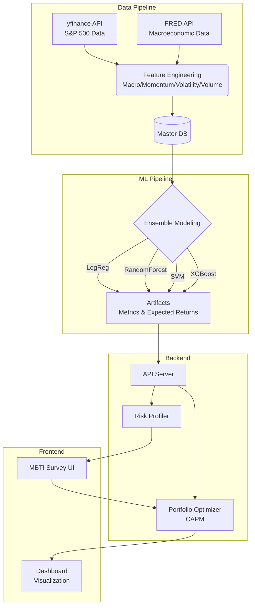
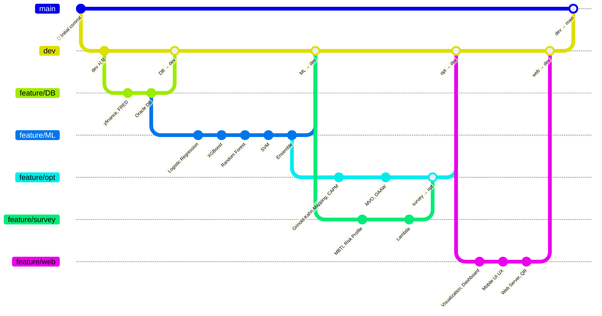

# 📈 Red & Blue: 투자 MBTI 진단 및 최적 자산 배분 알고리즘을 통한 포트폴리오 추천 서비스

<div align="center">
  
  
  
  <br><br>
  
  
  
  
  
</div>

---

## 📋 목차
1. [프로젝트 소개](#1-프로젝트-소개)
2. [팀원 구성 및 역할](#2-팀원-구성-및-역할)
3. [기술 스택](#3-기술-스택)
4. [시스템 아키텍처 및 파이프라인](#4-시스템-아키텍처-및-파이프라인)
5. [주요 기능](#5-주요-기능)
6. [화면 구성](#6-화면-구성)
7. [디렉토리 구조](#7-디렉토리-구조)
8. [브랜치 전략 및 협업 방식](#8-브랜치-전략-및-협업-방식)
9. [설치 및 실행 방법](#9-설치-및-실행-방법)

---

## 1. 📝 프로젝트 소개
**투자 MBTI 진단 및 최적 자산 배분 알고리즘을 통한 포트폴리오 추천 서비스**는 개인의 심리적 위험 감수 성향(투자 MBTI)과 앙상블 머신러닝(Ensemble ML) 예측 모델 및 자본 가격 결정 모형(CAPM)을 융합하여, 데이터 기반의 객관적인 투자 전략을 제시하는 풀스택 웹 서비스입니다. S&P 500 상위 300개종목의 거시경제 지표 및 시장 변동성등 16개 Features를 분석하여 종목별 기대 수익률을 산출하며, 이를 최적자산배분(OAA) 알고리즘에 적용함으로써 사용자별 투자 MBTI에 최적화된 퀀트 투자 포트폴리오를 제공하는 것을 목표로 합니다.

---

## 2. 👥 팀 구성 및 역할

| 이름 | 역할 | 주 담당 업무 | Github |
| :---: | :---: | :---: | :---: |
| **윤재정** | **총괄 & 금융공학** | - 프로젝트 총괄 및 금융 공학 모델 매핑<br>- 포트폴리오 최적화 엔진(MVO) 구현 | [@YounJJ](https://github.com/YounJJ) |
| **이대한** | **ML & 데이터 시각화** | - Ensemble ML 기반 종목 분석<br>- 메모리 캐싱 및 성능 최적화 수행<br>- 분석 데이터 시각화 구현 | [@eogks1235-byte](https://github.com/eogks1235-byte) |
| **이윤원** | **DB & 아키텍처** | - 데이터베이스(Oracle) 아키텍처 설계<br>- CI/CD 자동화 구축 및 모바일 환경 구현 | [@YWL-0225](https://github.com/YWL-0225) |
| **이우정** | **Frontend** | - Frontend 담당 및 동적 UI/UX 구현<br>- 설문 분석 및 투자 성향 진단 알고리즘 구축 | [@wjlee111](https://github.com/wjlee111) |
| **남기혁** | **Backend** | - Backend 담당 및 API 서버 아키텍처 설계<br>- 시장 데이터 수집 및 가공 | [@kiekuu](https://github.com/kiekuu) |

---

## 3. 🛠 상세 기술 스택 및 알고리즘 (Tech Stack & Algorithms)
### 🧠 Machine Learning & Data Science (머신러닝 및 데이터 사이언스)
가장 핵심이 되는 예측 파이프라인으로, 단일 모델이 아닌 교차 검증 및 앙상블 기법을 활용했습니다.

■ **분류 알고리즘 (Classification Models):**

- **Logistic Regression (로지스틱 회귀)**: 선형 기반의 베이스라인 이진 분류 모델
- **Random Forest (랜덤 포레스트)**: 의사결정나무(Decision Tree) 기반의 배깅(Bagging) 앙상블 모델
- **SVM (Support Vector Machine):** 비선형 데이터 경계면(Hyperplane)을 찾는 커널 분류 모델
- **XGBoost (eXtreme Gradient Boosting)**: 트리 기반의 그래디언트 부스팅(Boosting) 알고리즘

■ **고급 ML 기법 (Advanced ML Techniques):**

- **Ensemble Learning (앙상블 학습)**: 4가지 개별 모델의 예측 결과를 선형결합 하여 최종 예측의 안정성(Robustness)과 정확도를 극대화 (ensemble.py)
- **Hyperparameter Optimization (하이퍼파라미터 최적화)**: 각 종목별로 모델이 최상의 성능을 내도록 파라미터를 자동 탐색 및 튜닝 (결과물 _best_params.json 활용)
- **Feature Importance (피처 중요도 분석)**: 모델의 예측(IC)에 가장 큰 영향을 미친 변수(Macro, Momentum 등)를 추출하여 블랙박스 모델의 설명력(XAI) 부여 (importance.py)

### 📈 Financial Engineering & Optimization (금융 공학 및 포트폴리오 알고리즘)
단순한 예측을 넘어, 실제 투자 가능한 비율로 변환하기 위한 수학적/금융 알고리즘입니다.

- **Grinold-Kahn Modified Equation (알파 예측 매핑 알고리즘)**: 머신러닝의 단순 비선형 분류 결과(확률, Probability)를 Z-Score 형태의 시그널 강도로 치환하고, 종목 고유의 변동성(TE) 및 모델의 과거 타율(IC)을 곱하는 베이지안 페널티 방식을 적용하여 MVO 엔진이 소화 가능한 엄밀한 기대 초과수익률(Expected Alpha)로 매핑합니다. (mapping.py)
- **Regime Shift Overlay (비선형 수렴형 모멘텀 조정)**: 모델의 예측 수익률과 최근 3개월 실제 수익률 간의 Z-Score 괴리를 측정하고, 쌍곡탄젠트(Tanh) 비선형 함수를 통해 이상치 충격을 제어하면서 동적 국면 전환(Regime Shift)을 반영하는 자체 통계 자정(Self-Correction) 로직입니다. (adjust_regime.py)
- **CAPM (Capital Asset Pricing Model)**: Hard Gate를 통과하지 못한 방어형 종목들에 대해 무위험 수익률과 장기/단기 수축 추정(Shrinkage Estimation) 변동성 베타($\beta$)를 결합하여, 동적 시장 민감도를 사후적으로 보정하는 하이브리드 안전망 알고리즘입니다. (capm.py)
- **Mean-Variance Portfolio Optimization (마코위츠 평균-분산 최적화)**: 사용자의 위험 감수 성향 계수($\lambda$)에 맞춰 기댓값 극대화 및 공분산 리스크 최소화를 동시에 달성합니다. 최소 비중(5%) 및 종목 수 강제 조건을 풀기 위해 **혼합 정수 이차 계획법(MIQP)**을 Greedy Iterative Drop 휴리스틱으로 구현한 고도화 엔진입니다. (portfolio_optimizer.py)
- **Risk Profiling & Lambda($\lambda$) Inverse Mapping**: 12가지 다면적 질문과 최대 손실 %슬라이더를 사용, 95% 단측 신뢰구간(1.65) 모수적 VaR와 시장 장기 샤프 지수(0.7)를 역산하여 각 페르소나별 최적의 위험 회피 계수 $\lambda = 1.155/Loss_{Rep}$ 를 수학적으로 매핑하는 심리-수리 연동 알고리즘입니다. (risk_profile.py)
- **Monte Carlo Simulation (GBM & Brownian Bridge)**: 이토 보조정리(Ito's Lemma) 기반의 기하 브라운 운동(Geometric Brownian Motion) 모델을 통해 300개의 미래 주가 궤적을 렌더링하고, Drift 항을 소거한 극한의 보수적 모수적 VaR 5%를 산출합니다. 예측 메인 라인 통계를 위해서는 시작점과 타겟점을 강제 결박하는 브라운 브릿지(Brownian Bridge) 스토캐스틱 조건부 확률을 활용하여 시각적 직관성을 극대화합니다. (chart_data_provider.py)

### 📊 Data Engineering & Preprocessing (데이터 엔지니어링 알고리즘)
원시 데이터를 모델이 학습할 수 있는 파생 변수로 변환하는 고도화된 전처리 기술입니다.

- **Market Regime Detection (시장 국면 판별)**: 상승장, 하락장, 횡보장 등 현재 시장의 상태(Regime)를 수학적으로 감지하여 모델에 반영 (adjust_regime.py)
- **EWMA (Exponentially Weighted Moving Average, 지수이동평균)**: 최근 데이터에 더 큰 가중치를 두어 주가의 추세를 부드럽게 추적하는 알고리즘 (calculate_ewma.py)
- **Logarithmic Returns (로그 수익률 계산)**: 금융 시계열 데이터의 정규성을 확보하기 위한 연속 복리 수익률 변환 (calculate_log_returns.py)
- **Feature Engineering Domain**: 거시경제(Macro), 모멘텀(Momentum), 변동성(Volatility), 거래량(Volume) 기반의 파생 지표 생성 기술

### ⚙️ Backend & API (백엔드)
Framework: Python 기반의 빠르고 비동기 처리가 가능한 웹 프레임워크 (FastAPI)

- **Data Serving**: 계산된 최적 포트폴리오 배열과 수익률 차트 데이터를 프론트엔드 형식에 맞춰 가공하는 로직 (chart_data_provider.py, real_data_provider.py)

### 🎨 Frontend & UI/UX (프론트엔드)
- **Core**: React.js (v18+), JSX, JavaScript (ES6+)
- **Build Tool**: Vite (빠른 HMR 및 빌드 제공)
- **Data Visualization**: Recharts 기반의 동적 데이터 시각화 (도넛 차트, 누적 수익률 라인 차트, 게이지 차트 구현)
- **Styling**: CSS3 (반응형 웹 디자인 및 컴포넌트별 모듈화)
- **Linting**: ESLint (코드 컨벤션 유지)

### 🛠 Infra & DevOps (인프라 및 자동화)
- **CI/CD Automation**: GitHub Actions 기반의 Crontab 스케줄링. 매일 장 마감 후 자동으로 파이프라인(daily-db-load.yml)을 돌려 주가 데이터를 스크래핑하고 DB를 최신화
- **Data Source APIs**: yfinance API (S&P 500 개별 종목 주가 및 거래량), FRED API (거시경제 지표)
- **Batch Processing**: Shell Scripting (run_pipeline_300.sh)을 통한 대용량 데이터 일괄 자동 학습 시스템
- **Version Control**: Git & GitHub (Feature Branch 병렬 협업)

---

## 4. ⚙️ 시스템 아키텍처 및 파이프라인

프로젝트는 데이터 수집부터 웹 서빙까지 4단계의 유기적인 파이프라인으로 설계되었습니다.



---

## 5. 💡 주요 기능 및 핵심 기술 (Key Features)

단순한 주식 추천을 넘어, 데이터 수집부터 사용자 맞춤형 시각화까지 완벽한 풀스택 데이터 파이프라인을 제공합니다.

### 🎯 다면적 투자 MBTI 진단 및 개인화 (Risk Profiling)
* **동적 설문 알고리즘:** 사용자의 투자 경험, 목표 수익, 손실 감내 수준 등을 묻는 12가지 심층 문항(`Question.jsx`)을 통해 개인의 정확한 위험 회피도(Lambda)를 수치화합니다.
* **맞춤형 페르소나 부여:** 진단 결과에 따라 직관적이고 재미있는 투자 캐릭터(Yolo, Worker, Fire, Slave)를 매칭하여 사용자 경험(UX)을 극대화합니다.
* **인터랙티브 손실 슬라이더:** 사용자가 대시보드에서 직접 '최대 허용 손실률'을 조절하면(`LossSlider.jsx`), 즉각적으로 백엔드와 통신하여 포트폴리오 비중이 실시간으로 재조정됩니다.

### 🧠 앙상블(Ensemble) 기반 S&P 500 수익률 예측 모델
* **다차원 피처 엔지니어링:** 거시경제(Macro), 모멘텀(Momentum), 변동성(Volatility), 거래량(Volume) 등 4가지 도메인에서 시장의 흐름을 다각도로 분석하여 파생 변수를 생성합니다.
* **4중 교차 앙상블 학습:** 단일 모델의 한계를 극복하기 위해 로지스틱 회귀, 랜덤 포레스트, SVM, XGBoost 4개의 강력한 분류 알고리즘을 개별 학습시킵니다. 이후 **앙상블 기법(`ensemble.py`)**을 통해 예측 결과를 결합하여 정확도와 안정성을 극대화했습니다.
* **시장 국면 판별 (Market Regime):** 현재 시장이 상승장인지 하락장인지 수학적으로 계산(`adjust_regime.py`)하여 모델의 예측 값에 가중치를 동적으로 부여합니다.

### 📈 CAPM 기반 스마트 포트폴리오 최적화 (Financial Engineering)
* **기대 수익률 산출:** 머신러닝 예측 확률과 **CAPM(자본자산가격결정모형)**을 결합하여 각 종목의 합리적인 기대 수익률을 산출합니다.
* **평균-분산 최적화 (Mean-Variance Optimization):** 단순히 '오를 주식'을 추천하는 것이 아니라, 사용자의 투자 MBTI(위험 감수도)를 제약 조건으로 삼아 **수익은 극대화하고 리스크는 최소화하는 최적의 종목 편입 비중(Weight)**을 수학적으로 연산합니다. (`portfolio_optimizer.py`)

### 🔄 Zero-Touch 완전 자동화 데이터 파이프라인 (MLOps & CI/CD)
* **매일 스스로 진화하는 시스템:** 매일 장 마감 후 **GitHub Actions**의 크론(Cron) 스케줄러가 작동하여 `yfinance`와 `FRED API`로부터 최신 주가 및 거시경제 지표를 자동으로 스크래핑합니다. (`daily-db-load.yml`)
* **일괄 배치(Batch) 처리:** 수집된 데이터는 즉시 전처리 과정을 거쳐 마스터 데이터베이스(DB)를 최신화하며, 쉘 스크립트(`run_pipeline_300.sh`)를 통해 300여 개의 S&P 500 종목 모델이 사람의 개입 없이 자동으로 재학습 및 평가됩니다.

### 📊 직관적이고 동적인 데이터 시각화 대시보드 (Data Visualization)
* **인터랙티브 차트 구현:** Recharts 라이브러리를 활용하여 추천된 포트폴리오의 종목 비중을 아름다운 **파이 차트(Pie Chart)**로 제공합니다.
* **위험도 및 수익률 모니터링:** 추천된 포트폴리오의 과거 백테스팅 누적 수익률 추이를 라인 차트로 보여주며, 현재 포트폴리오의 위험 수준을 게이지 차트(Gauge Chart)로 직관적으로 표시하여 투자자의 올바른 의사결정을 돕습니다.

---

## 6. 🖥 화면 구성

| 메인 및 설문조사 | 투자 성향 결과 대시보드 | 포트폴리오 추천 차트 |
| :---: | :---: | :---: |
| , ,  | ,  |  |
| 12가지 문항을 통한<br>투자 성향 진단 진행 | MBTI에 매칭되는 캐릭터 및<br>위험 감수도(Loss Slider) 조정 | 개인화된 종목 비중<br>파이 차트 시각화 |

---

## 7. 📂 디렉토리 구조
MSA(Microservices Architecture) 형태를 지향하여 각 역할을 완벽히 분리했습니다.

```text
📦 Red-Blue-Mid-Project_OAA
 ┣ 📂 .github/workflows       # [자동화] 일일 데이터 수집 및 DB 갱신 CI/CD
 ┣ 📂 DB/                     # [데이터] 기초 자산 데이터 수집 및 병합 파이프라인
 ┃ ┣ 📜 build_master_dataset.py
 ┃ ┣ 📜 calculate_ewma.py
 ┃ ┗ 📂 utils/sp500_scraper.py
 ┣ 📂 Classification/         # [머신러닝] 피처 생성, 개별 모델 훈련 및 앙상블
 ┃ ┣ 📂 Preprocessing/        # 매크로, 모멘텀, 변동성 등 학습 변수 생성
 ┃ ┣ 📂 models/               # LogReg, RF, SVM, XGB 개별 모델 정의
 ┃ ┣ 📂 ensemble/             # 모델 결과 결합 알고리즘
 ┃ ┗ 📂 artifacts/            # [산출물] 각 종목별 학습 결과 및 매핑 요약 데이터
 ┣ 📂 investment-mbti-back/   # [백엔드] FastAPI 서빙 및 포트폴리오 산출 로직
 ┃ ┣ 📜 main.py
 ┃ ┣ 📜 portfolio_optimizer.py# 포트폴리오 비중 최적화 로직
 ┃ ┗ 📜 risk_profile.py       # 투자 MBTI 분류 로직
 ┣ 📂 investment-mbti/        # [프론트엔드] React + Vite 웹 애플리케이션
 ┃ ┣ 📂 public/images/        # 시각화 리소스 (YOLO, Slave 등 캐릭터 에셋)
 ┃ ┣ 📂 src/components/       # 설문조사, 차트 시각화 대시보드 컴포넌트
 ┃ ┗ 📂 src/constants/        # 설문 문항 및 주식 기초 상수 데이터
 ┗ 📂 scripts/                # 전체 파이프라인 통합 일괄 실행 스크립트 모음
```
---

## 8. 🔀 브랜치 전략 및 협업 방식

총 5명의 팀원이 데이터 엔지니어링, 머신러닝, 백엔드, 프론트엔드라는 상이한 도메인을 동시에 개발해야 했기 때문에, 철저한 **도메인 분리(Decoupling)** 와 **Feature Branch 기반의 GitHub Flow** 전략을 채택하여 충돌 없는 병렬 개발 환경을 구축했습니다.




<br>

### 📌 도메인 주도 브랜치 전략 (Domain-Driven Branching)
MSA(Microservices Architecture) 구조에 착안하여, 각 팀원이 담당하는 핵심 디렉토리를 기준으로 기능 브랜치(Feature Branch)를 엄격히 분리하여 작업했습니다.

* **`main` 브랜치:** 실제 서비스 배포 및 릴리스를 위한 안정적인(Stable) 통합 코드 베이스.
* **`dev` 브랜치:** 각 파트의 기능 개발이 완료된 후, 프론트엔드와 백엔드의 API 연동 및 파이프라인 통합 테스트를 진행하는 중앙 브랜치.
* **`feat/...` (기능 브랜치):** * `feat/DB`: yfinance 및 FRED API 연동, 마스터 DB 구축 작업
  * `feat/ML`: 4종 ML 모델링, 앙상블 파이프라인 구축 및 아티팩트 산출
  * `feat/opt`: FastAPI 기반 데이터 서빙 및 CAPM 포트폴리오 최적화 로직 개발
  * `feat/web`: React 기반 투자 성향 진단 UI 및 시각화 대시보드 구축

### 🤝 산출물(Artifacts) 기반의 병렬 협업 최적화
방대한 머신러닝 모델 학습 시간으로 인해 백엔드 개발이 지연되는 병목 현상을 막기 위해, 인터페이스 협약(Interface Agreement)을 만들었습니다.
* **Artifacts 중앙 저장소 활용:** 머신러닝 팀은 각 종목별 예측 확률과 평가지표를 `Classification/artifacts/` 디렉토리에 `.json` 형태로 덤프(Dump)하도록 설계했습니다.
* **완벽한 병렬 작업 달성:** 이를 통해 백엔드 팀은 머신러닝 파이프라인이 돌아가는 동안에도, 이미 생성된 Mock-up 아티팩트 데이터를 활용해 포트폴리오 산출 알고리즘(`portfolio_optimizer.py`)을 지연 없이 독립적으로 개발할 수 있었습니다.

### 🤖 GitHub Actions를 통한 CI/CD 및 운영 자동화 (MLOps)
코드를 통합하는 것을 넘어, 데이터의 신선도를 유지하기 위한 운영 자동화에 GitHub를 적극 활용했습니다.
* `.github/workflows/daily-db-load.yml`에 **Cron 스케줄러**를 등록하여, 매일 지정된 시간에 스크래핑 봇이 동작하고 최신 시장 지표로 마스터 데이터를 갱신하도록 CI/CD 파이프라인을 구축했습니다. 이는 수동 개입 없는 **Zero-Touch 파이프라인**을 완성한 핵심 협업 사례입니다.

---

## 9. 🚀 설치 및 실행 방법
> 프로젝트는 **Frontend(React)**, **Backend(Python API)**, 그리고 **ML Pipeline** 환경으로 완벽히 분리되어 독립적으로 구동됩니다.

### ☑️ Prerequisites (사전 요구 사항)
프로젝트를 로컬 환경에서 실행하기 위해 다음 소프트웨어의 설치가 필요합니다.
* **Node.js** (v16.x 이상 권장) 및 npm
* **Python** (v3.14 이상 권장)

### 🎨 Frontend (사용자 웹 UI) 실행
Vite와 React를 기반으로 구축된 클라이언트 화면을 구동합니다.

```bash
# 프론트엔드 디렉토리로 이동
$ cd investment-mbti

# 의존성 패키지 설치
$ npm install

# 로컬 개발 서버 기동 (일반적으로 http://localhost:5173 에서 접속 가능)
$ npm run dev
```
### ⚙️ Backend (API 서버 및 최적화 로직) 실행
사용자 성향 분석 및 CAPM 포트폴리오 비중 산출 API를 제공하는 백엔드 서버를 구동합니다.
```bash
# 백엔드 디렉토리로 이동
$ cd investment-mbti-back

# 파이썬 가상환경 생성 및 활성화 (권장)
$python -m venv venv$ source venv/bin/activate  # Windows의 경우: venv\Scripts\activate

# 의존성 라이브러리 설치
$ pip install -r requirements.txt

# API 메인 서버 실행
$ python3 main.py
```

### 🧠 ML Pipeline & Data Update (선택 사항)
GitHub Actions를 통해 매일 자동화되어 있으나, 로컬에서 수동으로 S&P 500 주가를 최신화하고 수백 개의 모델을 재학습시키고 싶을 경우 아래 쉘 스크립트를 사용합니다.
```bash
# 스크립트 디렉토리로 이동
$ cd scripts

# 실행 권한 부여 (macOS/Linux)
$ chmod +x run_pipeline_300.sh

# 전체 데이터 파이프라인 및 4종 앙상블 훈련 일괄 실행
$ ./run_pipeline_300.sh
```
---
