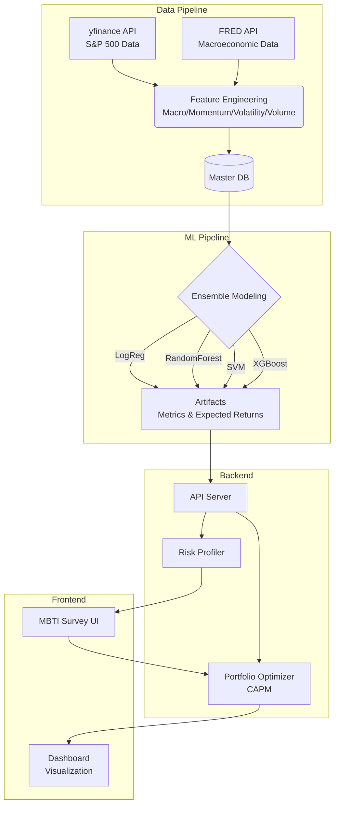
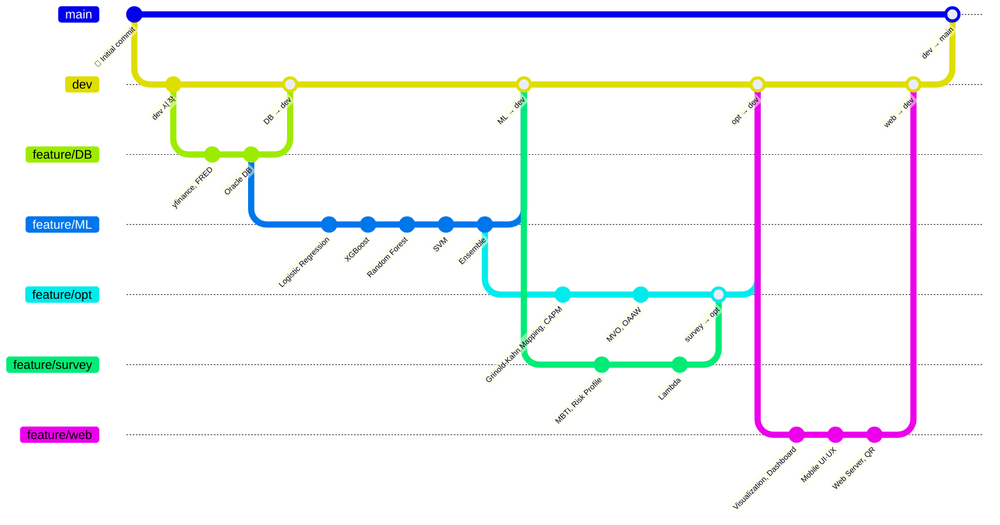

# 📈 Red & Blue: 투자 MBTI 진단 및 최적 자산 배분 알고리즘을 통한 포트폴리오 추천 서비스

<div align="center">
  
  
  
  <br><br>
  
  
  
  
  
</div>

---

## 📋 목차
1. [프로젝트 개요 및 기획 배경](#1-프로젝트-개요-및-기획-배경)
2. [팀원 구성 및 역할](#2-팀원-구성-및-역할)
3. [상세 기술 스택 및 알고리즘](#3-상세-기술-스택-및-알고리즘)
4. [시스템 아키텍처 및 파이프라인](#4-시스템-아키텍처-및-파이프라인)
5. [🔥 핵심 난관 및 해결 과정 (Troubleshooting)](#5--핵심-난관-및-해결-과정-troubleshooting)
6. [프로젝트 한계 및 향후 발전 방향](#6-프로젝트-한계-및-향후-발전-방향)
7. [프로젝트의 의의](#7-프로젝트의-의의)
8. [화면 구성](#8-화면-구성)
9. [디렉토리 구조](#9-디렉토리-구조)
10. [브랜치 전략 및 협업 방식](#10-브랜치-전략-및-협업-방식)
11. [설치 및 실행 방법](#11-설치-및-실행-방법)

---

## 1. 📝 프로젝트 개요 및 기획 배경

**"어떤 종목을 사야 할까?", "앞으로는 오를까? 내릴까?"**

금융 초보자들이 미국 주식 시장에 진입할 때 가장 먼저 겪는 심리적 장벽입니다. 본 프로젝트는 이러한 투자의 두려움을 직관적이고 알기 쉬운 퀀트(Quant) 전략으로 해소하고자 기획되었습니다.

**Red & Blue 서비스**는 개인의 심리적 위험 감수 성향(투자 MBTI)과 앙상블 머신러닝(Ensemble ML) 예측 모델, 그리고 자본 가격 결정 모형(CAPM)을 융합한 풀스택 웹 서비스입니다. S&P 500 상위 300개 종목의 거시경제 지표 및 시장 변동성 등 16개 Features를 분석하여 향후 수익률을 예측하고, 이를 최적 자산 배분(OAA) 알고리즘에 적용하여 유저 성향에 딱 맞는 맞춤형 AI 포트폴리오를 제안합니다.

---

## 2. 👥 팀 구성 및 역할

| 이름 | 역할 | 주 담당 업무 | Github |
| :---: | :---: | :---: | :---: |
| **윤재정** | **총괄 & 금융공학** | - 프로젝트 총괄 및 금융 공학 모델 매핑<br>- 포트폴리오 최적화 엔진(MVO) 및 휴리스틱 알고리즘 구현 | [@YounJJ](https://github.com/YounJJ) |
| **이대한** | **ML & 데이터 시각화** | - Ensemble ML 기반 종목 분석<br>- 메모리 캐싱 및 성능 최적화 수행<br>- 분석 데이터 시각화 구현 | [@eogks1235-byte](https://github.com/eogks1235-byte) |
| **이윤원** | **DB & 아키텍처** | - 데이터베이스(Oracle) 아키텍처 설계<br>- CI/CD 자동화 구축 및 모바일 환경 구현 | [@YWL-0225](https://github.com/YWL-0225) |
| **이우정** | **Frontend** | - Frontend 담당 및 동적 UI/UX 구현<br>- 설문 분석 및 투자 성향 진단 알고리즘 구축 | [@wjlee111](https://github.com/wjlee111) |
| **남기혁** | **Backend** | - Backend 담당 및 API 서버 아키텍처 설계<br>- 시장 데이터 수집 및 가공 | [@kiekuu](https://github.com/kiekuu) |

---

## 3. 🛠 상세 기술 스택 및 알고리즘

### 🧠 Machine Learning & Data Science 
단일 모델의 한계를 극복하기 위해 교차 검증 및 앙상블 기법을 활용했습니다.
- **분류 알고리즘 (Classification Models):** Logistic Regression, Random Forest, SVM, XGBoost 4종의 모델을 훈련.
- **Ensemble Learning (앙상블 학습):** 4가지 개별 모델의 예측 결과를 선형 결합하여 최종 예측의 안정성(Robustness)과 정확도를 극대화.
- **Feature Engineering:** yfinance 및 FRED API를 활용하여 거시경제(Macro) 5개, 모멘텀(Momentum) 5개, 변동성(Volatility) 4개, 거래량(Volume) 2개 피처를 산출했습니다.

### 📈 Financial Engineering & Optimization 
머신러닝의 예측 확률을 실제 투자 가능한 비중(Weight)으로 변환하는 금융 수학 알고리즘입니다.
- **Grinold-Kahn Modified Equation:** ML의 분류 결과(확률)를 Z-Score 형태의 시그널 강도로 치환하고, 변동성(TE) 및 모델의 과거 타율(IC)을 곱해 엄밀한 기대 초과수익률(Expected Alpha)로 매핑.
- **Regime Shift Overlay:** 비선형 수렴형 모멘텀 조정을 통해 동적 국면 전환(Regime Shift)을 반영하는 모델 자체 통계 자정(Self-Correction) 로직.
- **CAPM & Mean-Variance Optimization:** 유저의 위험 감수 계수($\lambda$)에 맞춰 마코위츠 평균-분산 최적화를 수행하여 수익 극대화 및 공분산 리스크 최소화.
- **Risk Profiling:** 12가지 다면적 설문을 통해 95% 단측 신뢰구간(1.65) 모수적 VaR와 시장 장기 샤프 지수(0.7)를 역산, 최적의 위험 회피 계수 $\lambda = 1.155/Loss_{Rep}$를 도출.
- **Monte-Carlo Simulation & Value at Risk (VaR):** 기하 브라운 운동(GBM)과 브라운 브릿지(Brownian Bridge) 확산 모델을 결합한 몬테카를로 시뮬레이션을 수행하여 미래 3개월 포트폴리오 성과의 확률 분포를 추정했습니다. 이를 통해 극단적 하방 리스크를 측정하는 5% VaR(Value at Risk)를 산출하고, 맞춤형 추천 대시보드에 시각화했습니다.

### 📊 Data Engineering & Web Stack
- **Market Regime Detection & EWMA:** 현재 시장 국면을 수학적으로 판별하고, 지수이동평균을 통해 주가 추세를 부드럽게 추적.
- **Backend:** Python 기반 비동기 프레임워크 FastAPI 서버 및 로직 서빙.
- **Frontend:** React.js, Vite, Recharts를 활용한 동적 데이터 시각화 대시보드.
- **MLOps:** GitHub Actions 크론 스케줄링을 통한 일일 자동 데이터 수집 및 모델 평가(CI/CD).

---

## 4. ⚙️ 시스템 아키텍처 및 파이프라인



---

## 5. 🔥 핵심 난관 및 해결 과정 (Troubleshooting)

프로젝트의 핵심 난관은 단순히 “좋은 종목을 맞히는 것”이 아니었습니다.  
실제 금융 데이터는 **노이즈가 매우 크고**, 모델의 예측값은 곧바로 포트폴리오 최적화에 투입하기 어렵습니다.  
따라서 본 프로젝트는 **신호의 신뢰도 검증 → 기대수익률 환산 → 예측 오차 보정 → 현실 제약 하 최적화**라는 4단계 Hurdle 구조를 설계하여, 예측과 운용 사이의 간극을 단계적으로 해소했습니다.

---

### Hurdle 1. 회귀의 한계를 인정하고, 분류 문제로 재정의

초기에는 각 종목의 향후 3개월 수익률을 직접 예측하는 **회귀(Regression)** 접근을 시도했습니다.  
그러나 주가 데이터 특유의 높은 변동성과 비선형성, 그리고 단기 수익률의 극단적 노이즈로 인해, 회귀 모델의 설명력은 사실상 **R² ≈ 0** 수준에 머물렀습니다.  
즉, “정확한 수익률 숫자”를 맞히는 문제는 현 시점의 데이터 구조와 모델 복잡도 하에서는 실용성이 낮다고 판단했습니다.

이에 따라 문제를 **“이 종목이 향후 3개월 동안 S&P 500을 일정 마진 이상 초과수익할 수 있는가?”** 라는 **이진 분류(Classification)** 문제로 재정의했습니다.  
이 전환은 금융공학적으로도 타당했습니다. 실제 투자 의사결정에서는 절대 수익률의 소수점보다, **상대적 우위와 방향성, 그리고 종목 간 순위(rank)** 가 더 중요한 경우가 많기 때문입니다.

또한 단일 모델의 편향을 줄이고 시장 국면 변화에 대한 강건성을 확보하기 위해, **Logistic Regression, Random Forest, XGBoost, SVM**의 4개 모델을 앙상블하여 최종 예측 확률을 산출했습니다.  
여기에 더해, 시계열 데이터에서 치명적인 문제인 **Leakage(데이터 누수)** 를 방지하기 위해 **Burn-in → Train → Embargo → Validation → Golden Gap → Test** 구조를 도입했습니다.  
이를 통해 미래 정보가 과거 학습 과정으로 역류하는 것을 차단하고, 모델의 성능을 보다 보수적이고 현실적으로 검증할 수 있었습니다.

마지막으로, 연산 낭비와 과적합된 종목을 사전에 걸러내기 위해 아래의 **3중 Hard Gate**를 설정했습니다.

- **Train-Test Gap ≤ 25%p**: 과적합 억제 및 일반화 가능성 확보  
- **Accuracy ≥ 52%**: 단순 무작위(50%)를 넘는 최소한의 통계적 우위 확보  
- **IC ≥ 0.05**: 단순 승패를 넘어, 종목별 수익률의 순위를 맞히는 알파 신호 검증  

즉, Hurdle 1의 본질은 “모든 종목을 억지로 예측하는 것”이 아니라,  
**투자에 사용할 수 있을 만큼 신뢰도 있는 신호만 다음 단계로 전달하는 필터링 시스템**을 구축한 데 있습니다.

---

### Hurdle 2. 분류 확률을 포트폴리오 입력값인 기대수익률로 번역

분류 모델의 출력은 어디까지나 **확률값(Probability)** 입니다.  
하지만 포트폴리오 최적화는 확률이 아니라, 종목별 **기대수익률 벡터**를 입력으로 요구합니다.  
즉, “상승 확률 0.68”이라는 정보만으로는 최적화 엔진이 작동할 수 없고,  
이를 **실제 투자 가능한 수익률의 언어로 번역하는 과정**이 반드시 필요했습니다.

이를 위해 본 프로젝트는 **Grinold-Kahn 기반 변형식**을 도입해,  
예측 확률을 신호 강도(Signal)로 변환하고, 여기에 **IC(예측 신뢰도)** 와 **3개월 추적오차(TE\_3M)** 를 결합해 종목별 기대 알파를 산출했습니다.

$$
E[\alpha_{3M}] = Signal \times IC \times TE_{3M}
$$

이 구조의 장점은 분명합니다.  
모델이 아무리 강한 매수 신호를 내더라도, 해당 종목의 **예측 신뢰도(IC)** 가 낮다면 기대 알파가 자동으로 축소됩니다.  
즉, 이 식은 단순한 매핑이 아니라, **모델 자신감과 리스크를 동시에 반영하는 수익률 환산 장치**로 작동합니다.

다만 모든 종목이 Hard Gate를 통과하는 것은 아니었습니다.  
실제로 전체 종목 중 일부만이 충분한 예측력을 보였고, 나머지 종목들까지 ML 예측을 억지로 적용하는 것은 오히려 포트폴리오 전체의 신뢰도를 훼손할 수 있었습니다.  
이를 해결하기 위해, **Hard Gate를 통과한 종목은 ML 기반 기대수익률을 사용하고**,  
**통과하지 못한 종목은 CAPM 기반 기대수익률로 보완하는 이원적 구조**를 설계했습니다.

$$
E[R_i] = R_f + \beta_i \bigl(E[R_M] - R_f\bigr)
$$

이 설계를 통해, 모델이 강한 종목에는 **알파 기반 능동적 기대수익률**을 부여하고,  
모델 신뢰도가 낮은 종목에는 **시장 민감도(beta)에 기반한 보수적 기대수익률**을 부여하여  
전체 유니버스를 끊김 없이 포괄할 수 있었습니다.  
즉, Hurdle 2는 **“예측 가능한 종목만 쓰는 시스템”이 아니라, 예측 가능성과 시장 일관성을 함께 만족하는 수익률 생성 시스템**을 구현한 단계였습니다.

---

### Hurdle 3. 예측과 실제 수익률의 괴리를 보정하는 조정 수익률 도입

모델이 Hard Gate를 통과했다고 해서, 예측값과 실제 실현수익률이 항상 일치하는 것은 아닙니다.  
특히 시장 레짐이 급변하거나, 테스트 구간에 최근 변동성이 충분히 반영되지 못한 경우,  
예측 기대수익률과 실제 성과 사이에 상당한 **Gap** 이 발생할 수 있었습니다.

이 문제는 단순한 모델 성능 이슈를 넘어,  
실제 서비스에서 사용자에게 “좋은 종목”을 추천하는 단계에서 매우 중요한 위험요소였습니다.  
예측값 자체만 믿고 추천할 경우, 통계적으로는 맞는 모델이라도 특정 종목에서 실현성과 괴리가 커질 수 있기 때문입니다.

이를 보완하기 위해 본 프로젝트는 **조정 수익률(Adjusted Return)** 개념을 도입했습니다.  
핵심 아이디어는 다음과 같습니다.

1. **예측 수익률과 실제 수익률 간 Gap 계산**
2. 해당 Gap을 변동성으로 나누어 **Z-surprise** 로 표준화
3. 극단값 폭주를 막기 위해 **tanh 함수**로 가중치를 $[-1,1]$ 범위로 정규화
4. 최종적으로 예측 기대수익률에 이 보정항을 반영해 **Adjusted Return** 산출

이 과정은 매우 중요했습니다.  
왜냐하면 단순 예측값만으로는 포착되지 않는 **최근 시장 국면과 오차 구조**를 반영해,  
추천 종목의 신뢰도를 한 단계 더 정교하게 재평가할 수 있었기 때문입니다.  
결과적으로 추천 후보군은 단순히 “예측 수익률이 높은 종목”이 아니라,  
**예측값이 높고, 동시에 실현성과의 괴리까지 관리된 종목**으로 압축되었습니다.

즉, Hurdle 3은 예측 모델을 그대로 신뢰하는 것이 아니라,  
**예측의 오차까지 모델링하여 실제 운용 가능한 추천 신호로 보정한 단계**라고 볼 수 있습니다.

---

### Hurdle 4. 현실적인 투자 제약조건과 최적화 문제의 폭발

앞선 Hurdle 1~3을 거치며, 전체 유니버스는 **신뢰도와 실현 가능성이 반영된 후보군**으로 정제되었습니다.  
이제 남은 문제는 이 후보군을 실제 포트폴리오로 바꾸는 것이었습니다.  
이를 위해 본 프로젝트는 사용자 성향(MBTI 기반 투자 페르소나)에 따라 서로 다른 제약 조건을 부여한 **MVO(Mean-Variance Optimization)** 를 설계했습니다.

최적화 목적함수는 다음과 같습니다.

$$
\max U = w^\top \mu - \frac{\lambda}{2} w^\top \Sigma w
$$

여기서

- $w$: 각 종목의 투자 비중 벡터  
- $\mu$: Hurdle 2, 3을 거쳐 산출된 종목별 기대수익률 벡터  
- $\Sigma$: EWMA 기반 공분산 행렬  
- $\lambda$: 설문 기반 투자 성향에서 도출된 위험회피계수  

이 식 자체는 고전적인 이차 계획법(QP)으로 풀 수 있습니다.  
하지만 문제는 **현실적인 투자 제약조건**을 추가하는 순간 발생했습니다.

사용자 성향별로

- 최소 투자 종목 수
- 개별 종목 최대 비중

이 달라졌고, 여기에 더해 **“편입된 종목은 반드시 5% 이상 투자해야 한다”** 는 Universal Rule을 적용하면서 문제가 급격히 복잡해졌습니다.

이 제약은 수학적으로 다음과 같은 **편입 여부의 이진 변수**를 필요로 합니다.

$$
0.05 z_i \le w_i \le w_i^{max} z_i,\quad z_i \in \{0,1\}
$$

즉, 어떤 종목이 포트폴리오에 포함되면 최소 5% 이상 담겨야 하고,  
포함되지 않으면 비중은 0이어야 한다는 **이산적 의사결정(binary decision)** 이 추가됩니다.  
이 순간 문제는 단순한 QP가 아니라, **혼합정수 이차계획법(MIQP)** 으로 바뀝니다.

MIQP는 분기한정(Branch-and-Bound) 탐색을 필요로 하며,  
후보 종목 수와 제약이 늘어날수록 계산량이 기하급수적으로 증가합니다.  
즉, 이론적으로는 가장 정교한 형태였지만, 실제 엔지니어링 환경에서는  
**오픈소스 솔버만으로 제한 시간 내 해를 안정적으로 찾기 어려운 병목**이 발생했습니다.

---

### The Solution. 반복적 소거 알고리즘 (Iterative Drop Heuristic)

이 문제를 해결하기 위해, 본 프로젝트는 MIQP를 한 번에 정면돌파하는 대신,  
문제를 여러 번의 **연속형 최적화 문제(QP)** 로 분해하는 **휴리스틱 알고리즘**을 직접 설계했습니다.  
핵심 아이디어는 단순합니다.  
처음부터 “최소 5% 제약”을 강하게 걸지 않고, 먼저 시장 경쟁력이 낮은 꼬리 종목들을 반복적으로 제거한 뒤,  
마지막에만 엄격한 제약을 적용하는 방식입니다.

#### Step 1. 초기 최적화 (Initial Solve)
최초에는 최소 편입 비중(5%) 제약을 제거한 상태에서,  
정제된 후보 종목 전체를 대상으로 1차 최적화를 수행합니다.  
이 단계의 목적은 “어떤 종목이 구조적으로 포트폴리오에서 경쟁력이 낮은지”를 빠르게 식별하는 것입니다.

#### Step 2. 취약 종목 제거 (Greedy Drop)
초기 해에서 비중이 매우 작거나 사실상 꼬리(tail)에 위치한 종목들은,  
엄격한 제약을 걸었을 때도 핵심 포지션이 되기 어렵다고 판단합니다.  
따라서 이 종목들을 **Greedy Drop 대상**으로 선정하여 비중을 0으로 고정하고 후보군에서 제거합니다.

#### Step 3. 반복적 정제 (Iterative Refinement)
탈락 종목을 제외한 새로운 유니버스에서 다시 최적화를 수행합니다.  
이 과정을 반복하면서, 남아 있는 종목들이 자연스럽게 더 큰 비중을 배정받도록 유도합니다.  
반복은 **모든 편입 종목이 최소 5% 이상을 만족할 때까지** 진행됩니다.

#### Step 4. 최종 최적화 (Final Solve)
후보군이 충분히 압축되면, 마지막으로 최소 편입 비중과 최대 비중 제약을 모두 반영한 최종 해를 구합니다.  
이 단계에서는 이미 저경쟁 종목이 제거되어 있기 때문에, 원래의 MIQP를 직접 푸는 것보다 훨씬 안정적이고 빠르게 해를 찾을 수 있습니다.

---

### Why It Worked: 엔지니어링 관점의 의의

이 접근의 핵심은 단순히 “편법을 썼다”는 데 있지 않습니다.  
오히려 금융 최적화 문제를 **신호 검증 → 수익률 환산 → 오차 보정 → 조합 최적화**로 단계적으로 분해함으로써,  
각 단계에서 문제의 차원을 줄이고, 최종적으로는 복잡한 조합 최적화 문제를 **현실적으로 계산 가능한 형태**로 바꿨다는 점에 의미가 있습니다.

정리하면, 본 프로젝트는 다음의 엔지니어링 문제를 해결했습니다.

- **예측 문제**: 회귀 실패를 분류와 앙상블로 전환  
- **신뢰도 문제**: Hard Gate로 과적합과 노이즈 차단  
- **수익률 문제**: Grinold-Kahn + CAPM으로 기대수익률 생성  
- **실현성 문제**: Adjusted Return으로 예측-실제 괴리 보정  
- **최적화 문제**: Iterative Drop Heuristic으로 MIQP 복잡도 완화  

결국 이 구조는 단순한 모델 하나가 아니라,  
**금융 데이터의 불완전성과 실제 투자 제약을 모두 감안한 end-to-end 의사결정 시스템**을 구현한 것입니다.  
그 결과, 사용자별 투자 성향을 반영하면서도 계산 가능하고 해석 가능한 포트폴리오를 안정적으로 산출할 수 있었습니다.

---

## 6. 🚧 프로젝트 한계 및 향후 발전 방향 (Limitations & Future Works)

본 프로젝트는 **사용자 성향 기반 위험회피계수(λ)**, **ML 기반 종목 선별**, **조정수익률(Adjusted Return)**, **MVO 기반 최적화**를 하나의 서비스 흐름으로 연결했다는 점에서 의미가 있습니다.  
다만 실제 금융시장에 적용 가능한 수준의 강건한 시스템으로 고도화하기 위해서는, 현재 구조가 가진 몇 가지 한계를 명확히 인식하고 이를 단계적으로 개선해 나갈 필요가 있습니다.

### 1) 현재 한계 (Limitations)

#### 1-1. 신뢰성 병목: Hard Gate 통과 종목 수의 구조적 한계
현재 파이프라인은 **Train-Test Gap ≤ 25%p, Accuracy ≥ 52%, IC ≥ 0.05**의 3중 Hard Gate를 통해, 과적합된 모델이나 투자 가치가 낮은 신호를 강하게 걸러내도록 설계되어 있습니다.  
이 기준은 모델의 품질을 보수적으로 관리한다는 장점이 있지만, 반대로 전체 유니버스 중 실제로 다음 단계까지 살아남는 종목 수를 크게 줄이는 병목으로 작용합니다.

특히 현재 실험에서는 **전체 300개 종목 중 79개만 Hard Gate를 통과**했기 때문에,  
나머지 종목에 대해서는 ML 예측 기반 기대수익률을 직접 사용하지 못하고 **CAPM 기반 보수적 기대수익률**로 대체해야 했습니다.  
즉, 현재 구조는 “신뢰할 수 있는 종목만 강하게 활용한다”는 장점이 있지만, 동시에 **모델 커버리지(coverage)** 측면에서는 아직 제한적입니다.

이는 곧 포트폴리오 추천 단계에서 다음과 같은 구조적 제약을 만듭니다.

- 추천 후보군이 특정 시기, 특정 섹터, 특정 스타일에 편중될 가능성
- Hard Gate 탈락 종목은 시장 베타 기반의 평균적 기대수익률만 반영되어, 개별 종목 고유의 알파 포착력이 제한됨
- 결과적으로 전체 유니버스를 대상으로 한 “정밀한 종목별 차별화”보다는, 일부 신뢰 종목 중심의 선별 구조에 가까움

---

#### 1-2. 수익률 매핑의 단순화: CAPM 폴백의 이론적·실무적 한계
Hard Gate를 통과하지 못한 종목에 대해서는 수익률 공백을 막기 위해 **CAPM 기반 기대수익률**을 사용했습니다.  
이 방식은 전체 종목 풀을 끊김 없이 커버할 수 있게 해준다는 점에서 매우 실용적이지만, 동시에 자산가격결정 관점에서 몇 가지 한계를 가집니다.

CAPM은 본질적으로 **시장 요인(beta) 하나만으로 기대수익률을 설명**하는 단일 요인 모델이기 때문에,

- 가치주/성장주 차이
- 대형주/중소형주 차이
- 수익성, 투자성향, 모멘텀 등 추가 팩터
- 개별 종목의 이벤트 리스크 및 비정형 정보

를 충분히 반영하지 못합니다.

즉, CAPM은 “예측 불가능 종목에 대한 안전한 기본값”으로는 적절하지만,  
실제 시장의 다요인 구조를 설명하기에는 다소 거친 근사치입니다.  
따라서 현재 설계는 **ML 신호가 강한 종목에는 정교하지만, 신호가 약한 종목에는 비교적 단순한 기대수익률을 부여하는 비대칭 구조**를 갖고 있습니다.

---

#### 1-3. 예측과 실현의 괴리: 조정수익률로 완화했지만 완전히 해소되지는 않음
본 프로젝트는 Hurdle 3에서 **예측 수익률과 실제 수익률 간 Gap**을 보정하기 위해  
Z-surprise와 tanh 기반의 **조정수익률(Adjusted Return)** 개념을 도입했습니다.  
이 접근은 최근 시장 변동성이 테스트셋에 충분히 반영되지 못했을 때 발생하는 괴리를 완화하는 데 유효했습니다.

그러나 이 방식 역시 본질적으로는 **사후적 오차 보정(post-adjustment)** 에 가깝기 때문에,  
근본적인 예측 오차 자체를 제거하는 것은 아닙니다.  
다시 말해, 현재 모델은 예측과 실현의 괴리를 줄이는 장치는 갖추고 있지만,  
시장 레짐 전환이 매우 급격하거나 특정 종목에 구조적 이벤트가 발생하는 경우에는 여전히 한계를 가질 수 있습니다.

---

#### 1-4. 최적화의 수리적 한계: Heuristic 기반 해법의 Local Optimum 가능성
사용자 성향별 제약조건(최소 투자 종목 수, 개별 종목 최대 비중)에 더해,  
**“포트폴리오에 편입된 종목은 반드시 5% 이상 투자해야 한다”** 는 Universal Rule을 적용하면서  
최적화 문제는 단순 QP가 아닌 **혼합 정수 이차계획법(MIQP)** 으로 확장되었습니다.

이 문제를 해결하기 위해 본 프로젝트는 **반복적 소거 알고리즘(Iterative Drop Heuristic)** 을 설계하여  
현실적인 연산 시간 안에서 해를 찾을 수 있도록 했습니다.  
이 방식은 엔지니어링 측면에서 매우 효과적이었지만, 수리적으로는 여전히 다음과 같은 한계가 존재합니다.

- 전역 최적해(Global Optimum)를 보장하지 못할 수 있음
- 초기 해(Initial Solve)에 따라 제거되는 종목 경로가 달라질 수 있음
- Greedy Drop 과정에서 장기적으로 유효한 분산효과(diversification benefit)를 가진 종목이 조기에 탈락할 가능성
- 특정 제약조건 조합에서 해의 안정성이 상용 MIQP 솔버 대비 떨어질 수 있음

즉, 현재 최적화는 **“현실적으로 계산 가능한 고성능 근사해”** 에 가깝고,  
엄밀한 의미의 완전한 전역 최적화라고 보기는 어렵습니다.

---

#### 1-5. 피처의 한계: 정형 시계열 중심 구조
현재 모델은 DXY, VIX, S&P500 수익률, 모멘텀, 변동성, 거래량 등  
주로 **거시경제 및 가격 기반 정형 시계열 피처**를 사용합니다.  
이 구조는 구현 안정성과 해석 가능성 측면에서는 장점이 있지만,  
개별 기업의 실적 발표, 가이던스 변화, 뉴스 이벤트, 경영진 발언과 같은  
**비정형 정보에서 발생하는 알파**는 아직 반영하지 못하고 있습니다.

이는 특히 다음과 같은 종목군에서 한계로 이어질 수 있습니다.

- 실적 발표 직후 급격히 재평가되는 성장주
- 뉴스 플로우에 민감한 이벤트 드리븐 종목
- 숫자로 포착되기 전 시장 심리가 먼저 움직이는 종목

즉, 현재의 feature space는 “시장과 가격의 움직임”은 비교적 잘 반영하지만,  
“정보의 내용(content)”과 “심리 변화(sentiment)”까지는 아직 담아내지 못합니다.

---

#### 1-6. 시장 스코프의 제한
현재 유니버스는 사실상 **미국 대형주 중심(S&P500 상위 300개 수준)** 에 초점이 맞춰져 있습니다.  
이 범위는 서비스 초기 버전에서 데이터 품질과 안정성을 확보하기에는 적절하지만,  
장기적으로는 다음과 같은 한계를 가집니다.

- 중소형주, 해외시장, 섹터 ETF, 채권/원자재 등 다른 자산군이 배제됨
- 시장 국면이 바뀌었을 때 미국 대형주 중심 전략의 상대적 매력이 낮아질 수 있음
- 사용자에게 “더 다양한 투자 기회 집합”을 제공하기 어려움

즉, 현재 시스템은 안정적인 출발점으로는 적합하지만,  
진정한 의미의 확장형 자산배분 플랫폼으로 가기 위해서는 유니버스 확장이 필요합니다.

---

### 2) 향후 발전 방향 (Future Works)

#### 2-1. Hard Gate 완화 및 모델 커버리지 확장
가장 우선적인 개선 방향은 **“통과 종목만 정교하게 다루는 구조”에서 “전체 유니버스를 더 세밀하게 다루는 구조”로의 전환**입니다.

이를 위해 향후에는 다음을 고려할 수 있습니다.

- 현재의 Hard Gate를 유지하되, **연속형 신뢰도 점수(confidence score)** 로 확장
- 통과/탈락의 이분법 대신, ML 기대수익률과 CAPM 기대수익률을 **가중 혼합(blending)** 하는 방식 도입
- 종목별 독립 학습을 넘어, 여러 종목의 정보를 함께 학습하는 **패널 데이터 기반 학습 구조**로 확장
- 전체 유니버스를 300개 이상으로 넓혀, 다양한 섹터와 스타일을 포괄하는 구조로 발전

이러한 개선이 이루어지면, 현재의 “79개 중심 고신뢰 전략”을 넘어  
**더 넓은 종목 풀을 안정적으로 커버하는 서비스형 엔진**으로 진화할 수 있습니다.

---

#### 2-2. CAPM에서 다요인 자산가격모형으로 고도화
Hard Gate 탈락 종목의 기대수익률을 보다 정교하게 산출하기 위해,  
향후에는 CAPM 대신 **Fama-French 3-Factor / 5-Factor, Carhart 4-Factor** 와 같은  
다요인 자산가격모형으로 확장할 수 있습니다.

예를 들어,

- 시장 요인(MKT)
- 규모 요인(SMB)
- 가치 요인(HML)
- 수익성 요인(RMW)
- 투자 요인(CMA)
- 모멘텀 요인(MOM)

을 함께 반영하면, 단일 beta 기반 CAPM보다  
개별 종목의 기대수익률을 더 풍부하게 설명할 수 있습니다.

즉, 향후 수익률 생성 엔진은

- **상위 레이어:** ML 기반 알파 신호
- **하위 레이어:** 다요인 기반 베이스 수익률

의 2계층 구조로 발전할 수 있으며,  
이는 포트폴리오 최적화의 입력값 자체를 더 정교하게 만들어 줄 것입니다.

---

#### 2-3. 비정형 데이터 결합: NLP 기반 알파 신호 추가
현재 모델의 예측 피처가 정형 데이터에 치우쳐 있다는 점을 보완하기 위해,  
향후에는 **뉴스 기사, 실적 발표(Earnings Call) 스크립트, SEC 공시, 기업 가이던스** 등을 활용한  
NLP 기반 파생변수 도입을 고려할 수 있습니다.

가능한 발전 방향은 다음과 같습니다.

- 뉴스 기사 감성 점수(sentiment score)
- 실적 발표문 톤 변화 및 긍·부정 언급 빈도
- 경영진 발언의 불확실성/확신도 측정
- 특정 키워드(예: restructuring, guidance cut, AI investment 등) 기반 이벤트 팩터 생성

이러한 비정형 신호는 기존의 가격·거시 피처가 포착하지 못하는 **정보 우위형 알파**를 보완할 수 있으며,  
특히 실적 시즌과 이벤트 드리븐 장세에서 유의미한 성능 개선을 기대할 수 있습니다.

---

#### 2-4. 최적화 엔진의 고도화
현재의 Iterative Drop Heuristic은 계산 효율 측면에서 충분히 유용하지만,  
향후에는 보다 정교한 탐색 전략을 통해 해의 품질을 개선할 수 있습니다.

예를 들어,

- 상용 MIQP 솔버와의 성능 비교를 통한 근사오차 정량화
- 유전 알고리즘(Genetic Algorithm), 시뮬레이티드 어닐링(SA), 탭 서치 등 **메타 휴리스틱** 접목
- Warm-start 전략과 branch-and-bound pruning 개선
- 리밸런싱 비용, turnover penalty, sector cap 등 추가 실전 제약 반영

을 통해 현재의 “빠른 근사해”를  
**더 안정적이고 더 실전적인 최적화 프레임워크**로 확장할 수 있습니다.

---

#### 2-5. 위험 측도와 추천 로직의 동적화
현재 위험회피계수(λ)는 설문 기반 투자 성향을 바탕으로 한 정적 파라미터에 가깝습니다.  
향후에는 사용자 행동 데이터와 시장 국면 정보를 결합하여,  
위험 성향과 추천 로직 자체를 동적으로 조정할 수 있습니다.

예를 들어,

- 시장 변동성 급등 시 보수형 성향 자동 강화
- 사용자의 실제 선택/이탈 패턴을 반영한 λ 재보정
- 추천 종목군과 최적화 결과를 분리하여, “선호 종목”과 “최적 종목”의 균형 조정

과 같은 방향으로 발전하면,  
서비스는 단순 설문형 추천을 넘어 **사용자-시장 상호작용 기반의 적응형 투자 어드바이저**로 진화할 수 있습니다.

---

#### 2-6. 시장 및 자산군 확장
장기적으로는 미국 대형주 중심 유니버스를 넘어 다음과 같은 확장이 가능합니다.

- 미국 중형주·소형주
- 한국 및 기타 선진국/신흥국 주식시장
- ETF, 채권, 금, 원자재, 리츠(REITs) 등 멀티에셋
- 글로벌 매크로 변수와 국가별 팩터를 반영한 다중 시장 배분

이렇게 되면 현재의 프로젝트는 “미국 주식 추천 서비스”를 넘어,  
**사용자 위험 성향 기반의 범용 자산배분 플랫폼**으로 확장될 수 있습니다.

---

### 3) 정리

정리하면, 현재 프로젝트는  
**신뢰도 검증(Hard Gate) → 기대수익률 환산(ML/CAPM) → 조정수익률 보정 → 성향 맞춤 최적화(MVO)**  
라는 end-to-end 구조를 성공적으로 구현했지만,  
여전히 다음과 같은 발전 여지를 가지고 있습니다.

- **모델 커버리지 확대**
- **기대수익률 추정 정교화**
- **비정형 데이터 반영**
- **최적화 해의 품질 개선**
- **시장 및 자산군 확장**

즉, 현재 시스템은 완성형이라기보다는,  
**실제 서비스 가능한 수준의 1차 작동 모델(MVP)을 구축한 상태**에 가깝습니다.  
향후 위 개선 방향들을 반영한다면, 본 프로젝트는 단순한 추천 시스템을 넘어  
사용자 성향과 금융공학을 결합한 **고도화된 AI 기반 자산배분 엔진**으로 발전할 수 있을 것입니다.

---

## 7. 💎 프로젝트의 의의 (Business Impact)

고도의 수학적/통계적 모델링이 필요한 퀀트 투자는 일반 개인 투자자들에게는 접근하기 힘든 미지의 영역이었습니다. 
본 프로젝트는 **복잡한 수식과 파이프라인을 유저 친화적인 'MBTI 페르소나'와 직관적인 데이터 시각화 안에 숨김**으로써 투자의 진입 장벽을 크게 낮추었습니다. 금융 초보자라도 간단한 설문과 슬라이더 조작만으로 기관 투자자 수준의 정교한 포트폴리오 산출(Active Return 타겟팅)을 직접 경험해볼 수 있는 플랫폼을 구현했다는 점에서 큰 의의가 있습니다.

---

## 8. 🖥 화면 구성

| 메인 및 설문조사 | 투자 성향 결과 대시보드 | 포트폴리오 추천 차트 |
| :---: | :---: | :---: |
| <br><br> | <br> |  |
| 12가지 문항을 통한<br>투자 성향 진단 진행 | MBTI에 매칭되는 캐릭터 및<br>위험 감수도(Loss Slider) 조정 | 개인화된 종목 비중<br>파이 차트 시각화 |

---

## 9. 📂 디렉토리 구조
역할 분리를 중심으로 데이터 파이프라인, 머신러닝, 백엔드, 프론트엔드가 분리된 구조입니다.

```text
📦 Red-Blue-Mid-Project_OAA
 ┣ 📂 .github/
 ┃ ┗ 📂 workflows/
 ┃   ┗ 📜 daily-db-load.yml                 # GitHub Actions 기반 일일 데이터 적재/갱신 워크플로우
 ┣ 📂 DB/                                   # 데이터 수집·정제·적재 파이프라인
 ┃ ┣ 📂 utils/
 ┃ ┃ ┗ 📜 sp500_scraper.py                  # S&P 500 종목 스크래핑 유틸
 ┃ ┣ 📜 __init__.py
 ┃ ┣ 📜 adjust_regime.py                    # 시장 국면(regime) 보정 로직
 ┃ ┣ 📜 build_master_dataset.py             # 통합 마스터 데이터셋 생성
 ┃ ┣ 📜 calculate_ewma.py                   # EWMA 지표 계산
 ┃ ┣ 📜 calculate_log_returns.py            # 로그 수익률 계산
 ┃ ┣ 📜 export_demo_snapshot.py             # 데모용 스냅샷 생성
 ┃ ┣ 📜 run_all_mapping.py                  # 전체 매핑 배치 실행
 ┃ ┣ 📜 run_all_tickers.py                  # 전체 종목 배치 실행
 ┃ ┣ 📜 sp500_top300.json                   # S&P 500 상위 300 종목 데이터
 ┃ ┣ 📜 sp500_top300_kr.json                # 상위 300 종목 한글 매핑 데이터
 ┃ ┣ 📜 stock_db_manager.py                 # DB 관리 로직
 ┃ ┣ 📜 update_market_data.py               # 시장 데이터 갱신
 ┃ ┣ 📜 update_risk_level_portfolio_snapshot.py # 위험 성향별 포트폴리오 스냅샷 갱신
 ┃ ┣ 📜 update_sp500_data.py                # S&P 500 데이터 갱신
 ┃ ┗ 📜 update_stock_data.py                # 개별 종목 데이터 갱신
 ┣ 📂 Classification/                       # 피처 생성, 모델 학습, 매핑, 앙상블, 산출물 관리
 ┃ ┣ 📂 Preprocessing/                      # 학습용 피처 생성 및 데이터셋 분할
 ┃ ┃ ┣ 📂 Macro/
 ┃ ┃ ┃ ┣ 📜 __init__.py
 ┃ ┃ ┃ ┗ 📜 macro.py                        # 거시경제 피처 생성
 ┃ ┃ ┣ 📂 Momentum/
 ┃ ┃ ┃ ┣ 📜 __init__.py
 ┃ ┃ ┃ ┗ 📜 momentum.py                     # 모멘텀 피처 생성
 ┃ ┃ ┣ 📂 Volatility/
 ┃ ┃ ┃ ┣ 📜 __init__.py
 ┃ ┃ ┃ ┗ 📜 volatility.py                   # 변동성 피처 생성
 ┃ ┃ ┣ 📂 Volume/
 ┃ ┃ ┃ ┣ 📜 __init__.py
 ┃ ┃ ┃ ┗ 📜 volume.py                       # 거래량 피처 생성
 ┃ ┃ ┣ 📜 __init__.py
 ┃ ┃ ┣ 📜 build_master_dataset.py           # 전처리 단계 통합 데이터셋 생성
 ┃ ┃ ┣ 📜 generate_target.py                # 타깃 라벨 생성
 ┃ ┃ ┗ 📜 split_dataset.py                  # 학습/검증 데이터 분할
 ┃ ┣ 📂 artifacts/                          # 종목별 모델 산출물 저장소
 ┃ ┃ ┣ 📂 A/                                # 그룹/종목 단위 산출물 디렉토리 예시
 ┃ ┃ ┃ ┣ 📂 ensemble/
 ┃ ┃ ┃ ┣ 📂 logreg/
 ┃ ┃ ┃ ┣ 📂 mapping/
 ┃ ┃ ┃ ┣ 📂 rf/
 ┃ ┃ ┃ ┣ 📂 svm/
 ┃ ┃ ┃ ┗ 📂 xgb/
 ┃ ┃ ┣ 📂 AAPL/                             # 종목별 산출물 디렉토리 예시
 ┃ ┃ ┃ ┣ 📂 ensemble/
 ┃ ┃ ┃ ┣ 📂 logreg/
 ┃ ┃ ┃ ┣ 📂 mapping/
 ┃ ┃ ┃ ┣ 📂 rf/
 ┃ ┃ ┃ ┣ 📂 svm/
 ┃ ┃ ┃ ┗ 📂 xgb/
 ┃ ┃ ┣ 📂 ABBV/
 ┃ ┃ ┣ 📂 ABNB/
 ┃ ┃ ┗ 📂 ...                               # 다수 종목별 아티팩트 디렉토리 반복
 ┃ ┣ 📂 capm/
 ┃ ┃ ┗ 📜 capm.py                           # CAPM 계산 로직
 ┃ ┣ 📂 ensemble/
 ┃ ┃ ┣ 📜 __init__.py
 ┃ ┃ ┗ 📜 ensemble.py                       # 개별 모델 예측 결합
 ┃ ┣ 📂 mapping/
 ┃ ┃ ┣ 📜 __init__.py
 ┃ ┃ ┗ 📜 mapping.py                        # 예측 결과 → 투자 시그널/점수 매핑
 ┃ ┣ 📂 models/
 ┃ ┃ ┣ 📂 common/
 ┃ ┃ ┃ ┣ 📜 __init__.py
 ┃ ┃ ┃ ┗ 📜 importance.py                   # 공통 피처 중요도 유틸
 ┃ ┃ ┣ 📂 logreg/
 ┃ ┃ ┃ ┣ 📜 __init__.py
 ┃ ┃ ┃ ┣ 📜 optimize.py                     # Logistic Regression 하이퍼파라미터 최적화
 ┃ ┃ ┃ ┗ 📜 pipeline.py                     # Logistic Regression 학습 파이프라인
 ┃ ┃ ┣ 📂 rf/
 ┃ ┃ ┃ ┣ 📜 __init__.py
 ┃ ┃ ┃ ┣ 📜 optimize.py                     # Random Forest 하이퍼파라미터 최적화
 ┃ ┃ ┃ ┗ 📜 pipeline.py                     # Random Forest 학습 파이프라인
 ┃ ┃ ┣ 📂 svm/
 ┃ ┃ ┃ ┣ 📜 __init__.py
 ┃ ┃ ┃ ┣ 📜 optimize.py                     # SVM 하이퍼파라미터 최적화
 ┃ ┃ ┃ ┗ 📜 pipeline.py                     # SVM 학습 파이프라인
 ┃ ┃ ┣ 📂 xgb/
 ┃ ┃ ┃ ┣ 📜 __init__.py
 ┃ ┃ ┃ ┣ 📜 optimize.py                     # XGBoost 하이퍼파라미터 최적화
 ┃ ┃ ┃ ┗ 📜 pipeline.py                     # XGBoost 학습 파이프라인
 ┃ ┃ ┗ 📜 __init__.py
 ┃ ┣ 📂 multi_ticker/
 ┃ ┃ ┣ 📜 __init__.py
 ┃ ┃ ┣ 📜 adjust_regime.py                  # 다중 종목용 국면 보정
 ┃ ┃ ┗ 📜 run_all_tickers.py                # 다중 종목 일괄 실행
 ┃ ┣ 📜 model_config.py                     # 모델 공통 설정
 ┃ ┗ 📜 model_gate.py                       # 모델 실행 진입/오케스트레이션
 ┣ 📂 common/
 ┃ ┗ 📜 __init__.py                         # 공용 Python 패키지 초기화
 ┣ 📂 investment-mbti-back/                 # 백엔드 API 및 포트폴리오 계산 로직
 ┃ ┣ 📂 data/
 ┃ ┃ ┣ 📜 .gitkeep
 ┃ ┃ ┗ 📜 demo_snapshot.json                # 데모 응답 스냅샷
 ┃ ┣ 📜 chart_data_provider.py              # 차트 데이터 제공 로직
 ┃ ┣ 📜 demo_snapshot.py                    # 데모 데이터 처리
 ┃ ┣ 📜 main.py                             # 백엔드 서버 엔트리포인트
 ┃ ┣ 📜 portfolio_optimizer.py              # 포트폴리오 비중 최적화 로직
 ┃ ┣ 📜 real_data_provider.py               # 실데이터 제공 로직
 ┃ ┣ 📜 requirements.txt                    # 백엔드 의존성 목록
 ┃ ┗ 📜 risk_profile.py                     # 투자 성향/리스크 프로파일 계산
 ┣ 📂 investment-mbti/                      # 프론트엔드 웹 애플리케이션
 ┃ ┣ 📂 public/
 ┃ ┃ ┣ 📂 images/
 ┃ ┃ ┃ ┣ 📜 Q1.png ~ Q12.png                # 설문 문항 이미지
 ┃ ┃ ┃ ┣ 📜 fire.png
 ┃ ┃ ┃ ┣ 📜 rogomain-transparent.png
 ┃ ┃ ┃ ┣ 📜 rogomain.png
 ┃ ┃ ┃ ┣ 📜 slave.png
 ┃ ┃ ┃ ┣ 📜 worker.png
 ┃ ┃ ┃ ┗ 📜 yolo.png                        # 캐릭터/브랜딩 에셋
 ┃ ┃ ┗ 📜 vite.svg
 ┃ ┣ 📂 src/
 ┃ ┃ ┣ 📂 components/                       # 화면/차트/설문 UI 컴포넌트
 ┃ ┃ ┃ ┣ 📜 CumulativeReturnChart.jsx
 ┃ ┃ ┃ ┣ 📜 DashboardResult.css
 ┃ ┃ ┃ ┣ 📜 DashboardResult.jsx
 ┃ ┃ ┃ ┣ 📜 Intro.css
 ┃ ┃ ┃ ┣ 📜 Intro.jsx
 ┃ ┃ ┃ ┣ 📜 InvestmentAmount.jsx
 ┃ ┃ ┃ ┣ 📜 Loading.css
 ┃ ┃ ┃ ┣ 📜 Loading.jsx
 ┃ ┃ ┃ ┣ 📜 LossSlider.css
 ┃ ┃ ┃ ┣ 📜 LossSlider.jsx
 ┃ ┃ ┃ ┣ 📜 MbtiBarChart.jsx
 ┃ ┃ ┃ ┣ 📜 PortfolioPieChart.jsx
 ┃ ┃ ┃ ┣ 📜 PortfolioSelection.css
 ┃ ┃ ┃ ┣ 📜 PortfolioSelection.jsx
 ┃ ┃ ┃ ┣ 📜 Question.css
 ┃ ┃ ┃ ┣ 📜 Question.jsx
 ┃ ┃ ┃ ┗ 📜 StockCard.jsx
 ┃ ┃ ┣ 📂 config/
 ┃ ┃ ┃ ┗ 📜 api.js                          # API 엔드포인트 설정
 ┃ ┃ ┣ 📂 constants/
 ┃ ┃ ┃ ┣ 📜 questions.js                    # 설문 문항 상수
 ┃ ┃ ┃ ┗ 📜 stocks.js                       # 종목/기초 데이터 상수
 ┃ ┃ ┣ 📜 App.css
 ┃ ┃ ┣ 📜 App.jsx
 ┃ ┃ ┣ 📜 index.css
 ┃ ┃ ┗ 📜 main.jsx
 ┃ ┣ 📜 .env.example
 ┃ ┣ 📜 .gitignore
 ┃ ┣ 📜 README.md
 ┃ ┣ 📜 eslint.config.js
 ┃ ┣ 📜 index.html
 ┃ ┣ 📜 package-lock.json
 ┃ ┣ 📜 package.json
 ┃ ┗ 📜 vite.config.js
 ┣ 📂 scripts/                              # 통합 실행 및 검증 스크립트
 ┃ ┣ 📜 __init__.py
 ┃ ┣ 📜 check_import_policy.py              # 모듈 import 정책 검사
 ┃ ┣ 📜 run_all_mapping.py                  # 전체 매핑 실행 스크립트
 ┃ ┗ 📜 run_pipeline_300.sh                 # 300개 종목 대상 전체 파이프라인 실행
 ┣ 📜 .gitignore
 ┣ 📜 LICENSE
 ┗ 📜 README.md
```

---

## 10. 🔀 브랜치 전략 및 협업 방식

총 5명의 팀원이 데이터 엔지니어링, 머신러닝, 백엔드, 프론트엔드라는 상이한 도메인을 동시에 개발해야 했기 때문에, 철저한 **도메인 분리(Decoupling)** 와 **Feature Branch 기반의 GitHub Flow** 전략을 채택하여 충돌 없는 병렬 개발 환경을 구축했습니다.



<br>

### 🤝 산출물(Artifacts) 기반의 병렬 협업 최적화
방대한 머신러닝 모델 학습 시간으로 인해 백엔드 개발이 지연되는 병목 현상을 막기 위해, **인터페이스 협약(Interface Agreement)**을 만들었습니다.
머신러닝 팀은 각 종목별 예측 확률과 평가지표를 `Classification/artifacts/` 디렉토리에 `.json` 형태로 덤프(Dump)하고, 백엔드 팀은 모델이 돌아가는 동안에도 이 Mock-up 아티팩트를 활용해 포트폴리오 산출 알고리즘(`portfolio_optimizer.py`)을 지연 없이 독립적으로 개발할 수 있었습니다.

---

## 11. 🚀 설치 및 실행 방법
> 프로젝트는 **Frontend(React)**, **Backend(Python API)**, 그리고 **ML Pipeline** 환경으로 완벽히 분리되어 독립적으로 구동됩니다.

### ☑️ Prerequisites (사전 요구 사항)
프로젝트를 로컬 환경에서 실행하기 위해 다음 소프트웨어의 설치가 필요합니다.
* **Node.js** (v16.x 이상 권장) 및 npm
* **Python** (v3.14 이상 권장)

### 🎨 Frontend (사용자 웹 UI) 실행
Vite와 React를 기반으로 구축된 클라이언트 화면을 구동합니다.

```bash
# 프론트엔드 디렉토리로 이동
$ cd investment-mbti

# 의존성 패키지 설치
$ npm install

# 로컬 개발 서버 기동 (일반적으로 http://localhost:5173 에서 접속 가능)
$ npm run dev
```

### ⚙️ Backend (API 서버 및 최적화 로직) 실행
사용자 성향 분석 및 CAPM 포트폴리오 비중 산출 API를 제공하는 백엔드 서버를 구동합니다.

```bash
# 백엔드 디렉토리로 이동
$ cd investment-mbti-back

# 파이썬 가상환경 생성 및 활성화 (권장)
$python -m venv venv$ source venv/bin/activate  # Windows의 경우: venv\Scripts\activate

# 의존성 라이브러리 설치
$ pip install -r requirements.txt

# API 메인 서버 실행
$ python3 main.py
```

### 🧠 ML Pipeline & Data Update (선택 사항)
GitHub Actions를 통해 매일 자동화되어 있으나, 로컬에서 수동으로 S&P 500 주가를 최신화하고 수백 개의 모델을 재학습시키고 싶을 경우 아래 쉘 스크립트를 사용합니다.

```bash
# 스크립트 디렉토리로 이동
$ cd scripts

# 실행 권한 부여 (macOS/Linux)
$ chmod +x run_pipeline_300.sh

# 전체 데이터 파이프라인 및 4종 앙상블 훈련 일괄 실행
$ ./run_pipeline_300.sh
```
